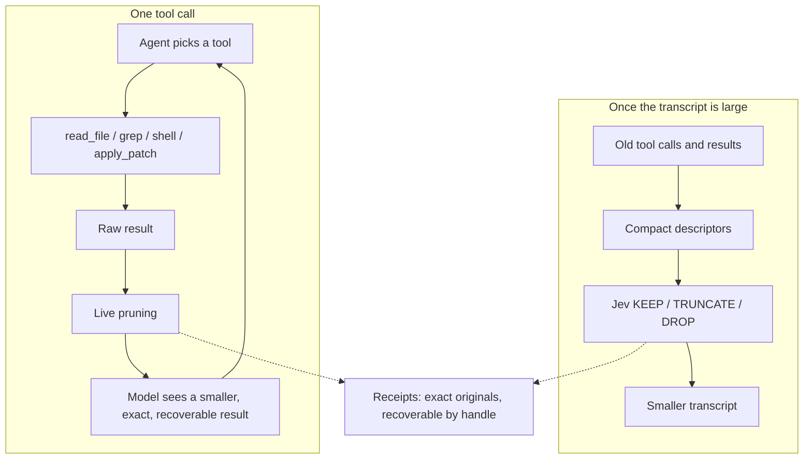

# ContextLens

A transparent context-reduction layer for coding agents.

Two things, both driven by cheap Jev relevance decisions. Large tool results are
pruned before the coding model reads them, and stale tool calls are garbage
collected out of a long transcript. Nothing is summarized, nothing is rewritten,
and everything removed stays exactly recoverable.

```text
Live pruning:           tool output -> Jev KEEP/DROP -> model
Transcript compaction:  old transcript -> Jev KEEP/TRUNCATE/DROP -> smaller transcript
```

## How it works

### Live pruning

```text
coding agent -> tool call -> raw tool result -> ContextLens -> smaller result -> coding model
```

1. **Record.** The raw result is written to a receipt before anything else, so
   it is recoverable even when nothing is pruned.
2. **Gate.** Output under the configurable minimum-size threshold passes
   through untouched. So does binary output, valid JSON, and unified diffs:
   cutting a hole in a machine-readable document leaves something that looks
   complete but is not.
3. **Chunk.** The output is split into line chunks, capped at 200, with very
   long lines split first.
4. **Protect deterministically.** The first and last chunks always survive, as
   does any chunk holding a recognized error, warning, traceback, test total,
   exit status, or artifact path -- or sitting next to one. No model is asked.
5. **Ask Jev.** One KEEP/DROP question per remaining chunk, batched so Jev's
   input stays bounded. A chunk also survives when its probability is merely
   uncertain, or when it was never scored. Removal requires confidence.
6. **Render.** Kept chunks are joined verbatim. Each run of dropped chunks
   becomes one marker naming the omitted line range and the receipt handle.

### Transcript compaction

When the transcript grows past a threshold, old tool calls and their results
become compact descriptors -- tool name, arguments, success or failure, output
size, a short preview, relative age -- and Jev answers two questions about each:
does the call still matter, and does its full result still need to stay
verbatim. Those two probabilities map to one deterministic action:

```text
KEEP       keep the tool call and its full result
TRUNCATE   keep the call, keep a short prefix and metadata of the result
DROP       remove the call together with its result
```

Jev never sees the results themselves, only descriptors, so the request stays
bounded however long the session runs.

### What Jev does not do

Jev makes relevance decisions and nothing else. It does not choose the agent's
next action, generate code, write commands, execute tools, create plans,
summarize the task, or manage the agent loop. Neither layer adds a
frontier-model turn: live pruning runs on the tool-response path, and compaction
rewrites a transcript the host already owns.

Every failure path fails open. A missing key, a gateway error, a malformed or
missing answer, a state that will not fit, or a reduction too small to be worth
it all return the original text unchanged.

## System design



The production surface is seven files:

| File | Responsibility |
| --- | --- |
| [`filtering.py`](src/contextlens/filtering.py) | Live pruning of one tool result |
| [`compaction.py`](src/contextlens/compaction.py) | Relevance-based garbage collection over a transcript |
| [`jev.py`](src/contextlens/jev.py) | Gateway, strict response validation, question batching, usage accounting |
| [`receipts.py`](src/contextlens/receipts.py) | Content-addressed store for originals; exact recovery |
| [`models.py`](src/contextlens/models.py) | Transcript and observation types, token estimates |
| [`cli.py`](src/contextlens/cli.py) | `prune`, `compact`, `recover`, `mcp` |
| [`mcp.py`](src/contextlens/mcp.py) | `context_prune` and `context_recover` over stdio |

`filtering.py` and `compaction.py` do not depend on each other. A host can use
either alone. Protected conservatively and never touched by compaction: the
original user task, the newest messages, host-pinned content such as explicit
user constraints, every edit, and recent failures. See
[`docs/architecture.md`](docs/architecture.md).

## Results

### Measured four-condition run, 21 September 2026

Ten frozen real Python GitHub issues (Click, responses, Luigi, Powertools,
Flask, Babel), two of them from SWE-bench-Live. `gpt-5.6-luna` at
`reasoning.effort=low`, 20 turns, 300 s, one trial. All four conditions share
the coding model, reasoning effort, issue prompt, repository commit, tool set,
timeout, turn limit, and hidden grader; only the ContextLens layers differ, and
the agent is never told ContextLens exists. Hidden graders calibrated 10/10. Jev
scored through the Vercel AI Gateway; coding-model calls went to OpenAI. 36 of
40 attempts completed: three hit the 20-turn limit and one died on an OpenAI
HTTP 503.

| Condition | Live pruning | Compaction |
| --- | --- | --- |
| `baseline` | no | no |
| `live_pruning` | yes | no |
| `compaction_only` | no | yes |
| `full_contextlens` | yes | yes |

| Condition | Verified Fixes | Coding Input | Uncached | Cached | Output | Total Coding | Raw Tool Output | Injected Tool Output | Tokens Removed | Agent Turns | Tool Calls | Compaction Events | Tasks Compacted | Recoveries | Jev Input | Jev Output | Jev Cost | Wall Clock |
| --- | ---: | ---: | ---: | ---: | ---: | ---: | ---: | ---: | ---: | ---: | ---: | ---: | ---: | ---: | ---: | ---: | ---: | ---: |
| Baseline | 5 | 622,586 | 69,094 | 553,492 | 18,702 | 641,288 | 60,844 | 60,844 | 0 | 137 | 129 | 0 | 0 | 0 | 0 | 0 | 0 | 445.9 s |
| Live Pruning | 5 | 435,221 | 51,955 | 383,266 | 19,595 | 454,816 | 57,647 | 38,791 | 18,856 | 137 | 127 | 0 | 0 | 0 | 71,895 | 2,457 | 0 | 535.3 s |
| Compaction Only | 5 | 480,956 | 66,484 | 414,472 | 14,765 | 495,721 | 60,596 | 60,596 | 0 | 116 | 107 | 0 | 0 | 0 | 0 | 0 | 0 | 356.4 s |
| Full ContextLens | 4 | 496,496 | 60,163 | 436,333 | 17,436 | 513,932 | 60,626 | 47,836 | 12,790 | 132 | 123 | 0 | 0 | 0 | 72,938 | 2,297 | 0 | 431.3 s |

| Metric vs Baseline | Live Pruning | Compaction Only | Full ContextLens |
| --- | ---: | ---: | ---: |
| Verified fixes | +0 | +0 | -1 |
| Coding-model input tokens | -187,365 (-30.1%) | -141,630 (-22.7%) | -126,090 (-20.3%) |
| Uncached coding-model input | -17,139 (-24.8%) | -2,610 (-3.8%) | -8,931 (-12.9%) |
| Cached coding-model input | -170,226 (-30.8%) | -139,020 (-25.1%) | -117,159 (-21.2%) |
| Output tokens | +893 (+4.8%) | -3,937 (-21.1%) | -1,266 (-6.8%) |
| Total coding-model tokens | -186,472 (-29.1%) | -145,567 (-22.7%) | -127,356 (-19.9%) |
| Injected tool output | -22,053 (-36.2%) | -248 (-0.4%) | -13,008 (-21.4%) |
| Agent turns | +0 (+0.0%) | -21 (-15.3%) | -5 (-3.6%) |
| Tool calls | -2 (-1.6%) | -22 (-17.1%) | -6 (-4.7%) |
| Wall clock | +89.4 s (+20.0%) | -89.5 s (-20.1%) | -14.6 s (-3.3%) |

| Task | Base | Live | Compact | Full | Base Input | Live Input | Compact Input | Full Input |
| --- | --- | --- | --- | --- | ---: | ---: | ---: | ---: |
| aws-powertools-eventbridge-replay | ❌ | ✅ | ✅ | ❌ | 47,840 | 33,360 | 77,937 | 25,193 |
| aws-powertools-query-merge | ❌ | ❌ | ❌ | ❌ | 149,710 | 70,334 | 84,515 | 104,300 |
| click-empty-default | ❌ | ❌ | ❌ | ❌ | 36,848 | 31,359 | 25,059 | 41,202 |
| click-short-help | ❌ | ❌ | ❌ | ❌ | 32,469 | 29,319 | 28,672 | 28,096 |
| pallets-flask-trusted-hosts | ❌ | ❌ | ❌ | ❌ | 135,474 | 104,507 | 106,276 | 88,108 |
| python-babel-parse-time | ✅ | ✅ | ✅ | ✅ | 35,132 | 29,900 | 34,992 | 22,551 |
| responses-blank-query | ✅ | ✅ | ✅ | ✅ | 27,183 | 23,846 | 29,483 | 28,113 |
| responses-query-mutation | ✅ | ✅ | ✅ | ✅ | 28,988 | 23,836 | 24,286 | 20,615 |
| spotify-luigi-bool-default | ✅ | ✅ | ✅ | ✅ | 46,449 | 38,152 | 62,918 | 58,796 |
| spotify-luigi-run-arguments | ✅ | ❌ | ❌ | ❌ | 82,493 | 50,608 | 6,818 | 79,522 |

Every condition, **including the inert `compaction_only` control**, failed
`spotify-luigi-run-arguments`, so that regression is task flakiness rather than
pruning. `compaction_only`'s attempt on it is also the one that died on the 503.

Full report:
[`benchmarks/results/four-condition-2026-09-21-tuned.md`](benchmarks/results/four-condition-2026-09-21-tuned.md).

### Two earlier runs, for contrast

**Over-conservative defaults, same tasks.** An earlier run of the same four
conditions used `minimum_tokens=1500` and an uncertainty floor of `0.1`, copied
from `jev-pruner` (whose own gate is 10,000 tokens). That made live pruning
almost inert on this workload: it removed **1,481 of 55,279** raw tool-output
tokens (2.7%) and moved coding-model input by **-3.4%**, inside the noise floor.
Verified fixes were 5 / 5 / 7 / 5. Report:
[`benchmarks/results/four-condition-2026-09-21.md`](benchmarks/results/four-condition-2026-09-21.md).

**Previous architecture.** The run that retired AST structural expansion
measured Baseline **583,459** coding-model input tokens with 5/10 fixes, Jev
filtering alone **379,716** with 7/10, and Jev filtering plus AST expansion
**1,105,615** with 5/10. Report:
[`docs/history/coding-agent-2026-09-21.md`](docs/history/coding-agent-2026-09-21.md).

### Offline harness check

What can be measured without credentials: a scripted solver replays one fixed
tool sequence against a synthetic repository, and a local heuristic answers the
relevance questions in Jev's place.

| Condition | Raw Tool Output | Injected Tool Output | Removed | Compaction Events | Compaction Tokens Removed | Final Transcript |
| --- | ---: | ---: | ---: | ---: | ---: | ---: |
| Baseline | 6,587 | 6,587 | 0 | 0 | 0 | 6,753 |
| Live Pruning | 6,587 | 477 | 6,110 (92.76%) | 0 | 0 | 643 |
| Compaction Only | 6,587 | 6,587 | 0 | 1 | 3,275 | 3,478 |
| Full ContextLens | 6,587 | 477 | 6,110 (92.76%) | 1 | 250 | 393 |

Tool calls (6) and agent turns (7) are identical across all four conditions, by
construction. Each layer reduces context on its own and they compose. This
exercises the layers and the report; it runs no coding model, so it says nothing
about task success or frontier-model savings, and its compaction trigger is
deliberately lowered because the scripted transcript is tiny. Raw rows:
[`benchmarks/results/offline.json`](benchmarks/results/offline.json).

## What the numbers mean

**Live pruning met the goal on this trial. Transcript compaction was never
exercised.**

- **Live pruning held verified fixes at 5/10, the same as baseline, while
  cutting injected tool output 36.2%** (60,844 → 38,791 tokens), uncached
  coding-model input **24.8%** (69,094 → 51,955), and total coding-model input
  **30.1%** (622,586 → 435,221). Agent turns were identical (137 vs 137) and
  tool calls fell 1.6%, so it did not push the agent into extra work.
- **Read total-input deltas with care.** `compaction_only` fired zero compaction
  events, making it mechanically identical to baseline, and it still shows
  **-22.7%** total input. That is this suite's noise floor, inflated because one
  of its attempts died on an OpenAI 503 after two turns. The comparisons that
  survive that control are **injected tool output** (-36.2% for live pruning
  against -0.4% for the inert control) and **uncached input** (-24.8% against
  -3.8%) — both direct, mechanical effects of pruning.
- **Compaction never triggered.** Zero events in 20 attempts. The largest
  transcript reached **14,178** estimated tokens against the 20,000-token
  production trigger, which was not lowered. Ten single-file bug fixes at 20
  turns do not build a long enough session. The layer is implemented and tested
  but remains unmeasured against a real coding model.
- **`full_contextlens` is live pruning plus an inert layer**, and it fixed one
  task fewer (4/10) while pruning less (12,790 vs 18,856 tokens removed). With
  compaction doing nothing, that gap is trajectory variance, not composition.
- **The one regression is task flakiness.** Every condition failed
  `spotify-luigi-run-arguments`, including the inert control, and baseline
  passed it. No condition-specific cause.
- **Where live pruning engaged, it engaged rarely and precisely.** Of 204
  observations: 103 were below the size gate, 33 had too few chunks, 33 were
  scored and kept whole, **22 were pruned**, 7 hit gateway failures and failed
  open, and 6 were structured documents skipped by design. Recovery calls: **0**
  — nothing it dropped was ever asked for back.
- **Jev is cheap and separate.** 71,895 input / 2,457 output tokens for live
  pruning at a gateway-reported cost of 0, never added to coding-model input.
- **It costs latency.** Live pruning's wall clock rose 20.0% (445.9 s → 535.3 s)
  because each large observation waits on Jev before the model sees it.

### What I got wrong first, and how it was found

The first run of this benchmark showed live pruning removing 2.7% of tool output
and changing input by -3.4%. Three settings carried over from `jev-pruner`, whose
gate is tuned for 10,000-token shell logs, were wrong for this workload:

| Setting | Was | Now | Why |
| --- | --- | --- | --- |
| `minimum_tokens` | 1,500 | **256** | Average tool result here is ~500 tokens, so almost nothing was eligible |
| `uncertain_keep_probability` | 0.1 | **0.0** | Measured against real Jev, disposable output scores 0.1–0.2, so a 0.1 floor keeps everything and pruning never happens |
| `max_chunks` | 200 | **32** | 200 chunks meant ~14 Jev requests per observation; the gateway answered HTTP 429 "providers at capacity" and every rate-limited batch failed the whole observation open |
| `max_state_tokens` | 25,000 | **12,000** | Measured: ~25,000-token states are refused with 429, everything at or below ~16,000 succeeds |

The gateway now retries 429 and 5xx with backoff instead of silently failing
open, and every run records why each observation was or was not pruned — without
that, "Jev kept everything" and "the gateway rate limited us" produce identical
zeros.

### Still open

- Compaction is unproven. It needs sessions long enough to reach its trigger.
- One trial of ten tasks cannot resolve a ±2 fix difference, as the inert control
  demonstrates. Reduction claims rest on the mechanical metrics, not fix counts.
- The 20% latency cost of live pruning is real and unoptimized.
- **AST structural expansion** remains retired: +522,156 input tokens (+89.5%)
  against baseline, driven by two runaway trajectories. See
  [`experiments/structural_expansion/`](experiments/structural_expansion/).
- **A `context_next` loop** in which Jev chose the agent's next capability kept
  2/3 verified fixes, timed out once, and used 156.21% more complete input.
  Deciding for the agent cost input and turns, which is why Jev only decides
  relevance.

## Run it

Python 3.12+, no runtime dependencies.

```bash
python -m pip install -e .
```

Live pruning and compaction need a Vercel AI Gateway key. Without one both fail
open and return the original text:

```bash
export AI_GATEWAY_API_KEY="your-vercel-ai-gateway-key"

pytest -q 2>&1 | contextlens prune --task "fix the failing parser test" --tool shell
contextlens compact --transcript transcript.json --json
contextlens recover cl_RECEIPT_ID --receipts .contextlens/receipts
contextlens mcp --task "fix the failing parser test" --receipts .contextlens/receipts
```

Vercel Pro and Enterprise users can set `CONTEXTLENS_VERCEL_ZDR=1` for
zero-data-retention routing. Thresholds are configurable through
`CONTEXTLENS_MIN_TOKENS`, `CONTEXTLENS_CHUNK_LINES`,
`CONTEXTLENS_KEEP_THRESHOLD`, and `CONTEXTLENS_MAX_STATE_TOKENS`.

The four-condition paired coding-agent benchmark, and the offline harness check
that needs no credentials. Nine of the ten hidden graders shell out to `uv`:

```bash
export OPENAI_API_KEY="..."
export AI_GATEWAY_API_KEY="..."
python -m pip install uv
python -m benchmarks.run --output benchmarks/artifacts/paired --trials 1 --timeout 300

python -m benchmarks.offline --output benchmarks/results/offline.json
```

Development:

```bash
python -m pip install -e ".[dev]"
pytest
ruff check .
mypy
mypy --ignore-missing-imports benchmarks tests
```

| Folder | What's in it |
| --- | --- |
| [`src/contextlens/`](src/contextlens/) | The two layers, the Jev client, receipts, CLI, MCP |
| [`tests/`](tests/) | Pruning, compaction, recovery, CLI, MCP, and benchmark coverage |
| [`benchmarks/`](benchmarks/) | Frozen coding-agent tasks, the paired harness, the offline check |
| [`docs/`](docs/) | [Architecture](docs/architecture.md) and [history](docs/history/) |
| [`experiments/`](experiments/) | Retired research, not imported by the package |

Released under the [MIT License](LICENSE).

## Credits

The two layers are modelled directly on Tamara Tran's work:
[fast-jev-compaction](https://github.com/tamaratran/fast-jev-compaction) for
descriptor-based transcript compaction, and
[jev-pruner](https://github.com/tamaratran/jev-pruner) for pruning live tool
output. The token estimator, the staged state fitting, the uncertainty
safeguard, and the two-question decision table all come from there.

Jev by [TypeSafe AI](https://www.typesafe.ai) through the
[Vercel AI Gateway](https://vercel.com/ai-gateway/models/jev). Frozen tasks from
[Click](https://github.com/pallets/click),
[responses](https://github.com/getsentry/responses),
[Luigi](https://github.com/spotify/luigi),
[Powertools](https://github.com/aws-powertools/powertools-lambda-python),
[Flask](https://github.com/pallets/flask), and
[Babel](https://github.com/python-babel/babel), two of them from
[SWE-bench-Live](https://github.com/SWE-bench/SWE-bench-Live).
