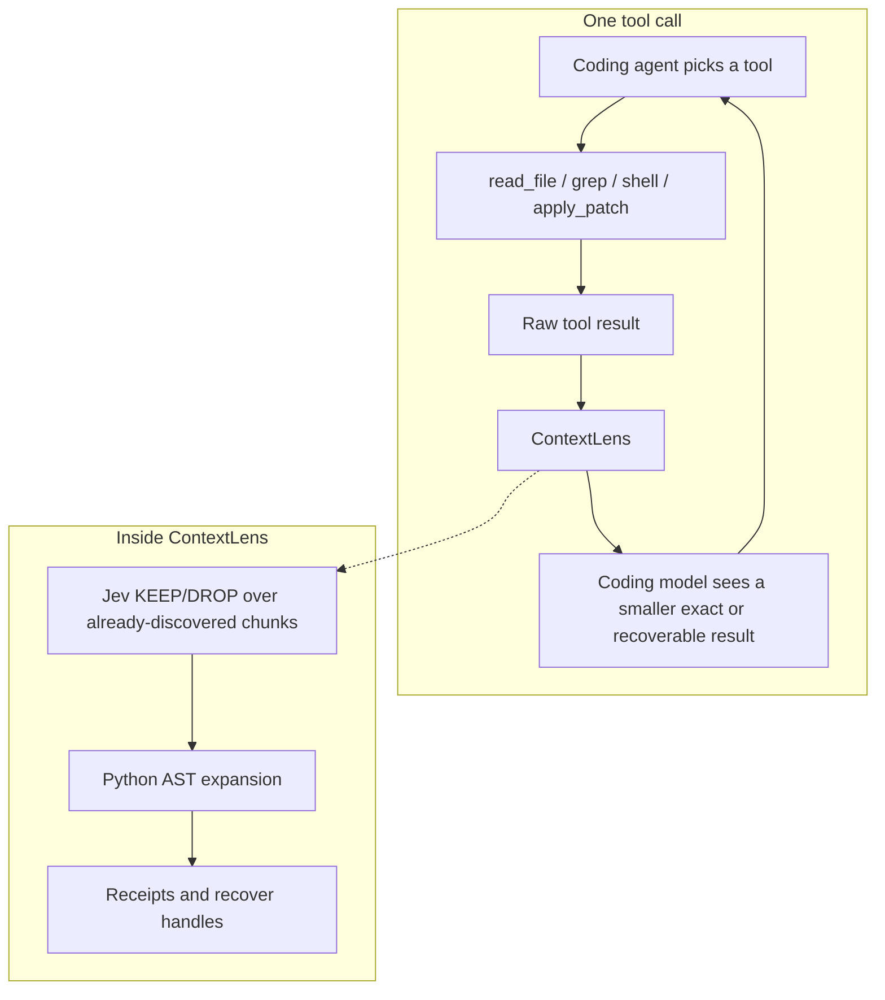

# ContextLens

A transparent context-reduction layer for coding agents.

It filters large tool outputs and source reads before they enter the coding
model. Jev cheaply scores semantic relevance. Local structural analysis keeps
code dependencies. Omitted evidence stays recoverable.

## How it works

1. **Tools.** The coding agent searches, reads, tests, and patches as usual. It
   is not told to use ContextLens.
2. **Filter.** Large tool output is split into candidates. Jev returns KEEP or
   DROP only. It does not pick the next action, run tools, or write code.
3. **Structure.** For Python source, the AST adds imports, class headers, and
   referenced constants around what Jev kept.
4. **Recover.** Anything omitted is stored behind a stable handle. The original
   text can be restored exactly.
5. **Model.** Only the reduced observation is appended to the coding-model
   transcript. Jev tokens are recorded separately and are never added to
   coding-model input.

Small files, explicit line-range reads, and known-symbol reads pass through.
If Jev is unavailable, filtering fails open and the raw tool result is kept.

## System design

ContextLens is not an agent controller. The coding agent still decides what to
do. Filtering happens on the tool-response path so it does not add extra
coding-model turns.



The default MCP profile is `context_filter`, `context_read`, `context_recover`,
`context_pin`, and `context_list`. Pinned items, including the current task,
are never dropped automatically. A `context_next` controller profile exists
for research; it is not the default.

## Results

Ten frozen real Python GitHub issues (Click, responses, Luigi, Powertools,
Flask, Babel), including two SWE-bench-Live lite tasks. The agent sees original
issue text only. Gold patches and hidden tests stay on the host.

Three conditions share the same model, reasoning, prompt, commit, tools,
timeout, and max turns:

1. **Baseline** — raw tool outputs
2. **Jev Filter** — KEEP/DROP, no AST expansion
3. **ContextLens** — Jev plus structural expansion and recovery handles

21 September 2026, `gpt-5.6-luna`, `reasoning.effort=low`, 20 turns, 300s.
Hidden graders calibrated 10/10. All 30 paired attempts completed. Jev scored
through the Vercel AI Gateway. Coding-model calls stayed on OpenAI.

| Condition   | Verified Fixes | Coding Input Tokens | Uncached Input | Cached Input | Output Tokens | Total Coding Tokens | Raw Tool Output | Injected Tool Output | Tokens Removed | Agent Turns | Recoveries | Jev Input |
| ----------- | -------------: | ------------------: | -------------: | -----------: | ------------: | ------------------: | --------------: | -------------------: | -------------: | ----------: | ---------: | --------: |
| Baseline    |              5 |             583,459 |         67,718 |      515,741 |        14,975 |             598,434 |          46,950 |               46,950 |              0 |         136 |          0 |         0 |
| Jev Filter  |              7 |             379,716 |         57,359 |      322,357 |        16,137 |             395,853 |          48,276 |               26,920 |         21,356 |         134 |          0 |   136,505 |
| ContextLens |              5 |           1,105,615 |        151,696 |      953,919 |        14,989 |           1,120,604 |         138,931 |              119,054 |         19,877 |         141 |          0 |   124,519 |

| Metric                      | Jev Filter vs Baseline | ContextLens vs Baseline |
| --------------------------- | ---------------------: | ----------------------: |
| Coding-model input tokens   |       -203,743 (-34.9%) |        +522,156 (+89.5%) |
| Uncached coding-model input |        -10,359 (-15.3%) |         +83,978 (+124.0%) |
| Injected tool output        |        -20,030 (-42.7%) |         +72,104 (+153.6%) |
| Agent turns                 |              -2 (-1.5%) |               +5 (+3.7%) |
| Verified fixes              |                      +2 |                       +0 |

| Task                                | Baseline | Jev Filter | ContextLens | Baseline Input | Jev Filter Input | ContextLens Input |
| ----------------------------------- | -------- | ---------- | ----------- | -------------: | ---------------: | ----------------: |
| aws-powertools-eventbridge-replay   | ✅        | ✅          | ✅           |         79,418 |           30,005 |            29,772 |
| aws-powertools-query-merge          | ❌        | ❌          | ❌           |        125,593 |           80,315 |            79,077 |
| click-empty-default                 | ❌        | ❌          | ❌           |         61,088 |           30,619 |            34,485 |
| click-short-help                    | ❌        | ❌          | ❌           |         27,291 |           18,250 |           490,067 |
| pallets-flask-trusted-hosts         | ❌        | ✅          | ❌           |         79,769 |           75,477 |            73,710 |
| python-babel-parse-time             | ✅        | ✅          | ✅           |         37,987 |           28,294 |            40,720 |
| responses-blank-query               | ✅        | ✅          | ✅           |         24,891 |           24,289 |            22,721 |
| responses-query-mutation            | ✅        | ✅          | ✅           |         24,342 |           23,998 |            24,796 |
| spotify-luigi-bool-default          | ✅        | ✅          | ✅           |         41,709 |           39,789 |            45,746 |
| spotify-luigi-run-arguments         | ❌        | ✅          | ❌           |         81,371 |           28,680 |           264,521 |

Verified fixes: Baseline **5/10**, Jev Filter **7/10**, ContextLens **5/10**.
This is one trial of ten tasks, not a statistical quality claim.

The live gate is: task success does not regress, coding-model input decreases
meaningfully, and agent turns do not materially increase. On this trial, Jev
Filter met those three numbers. ContextLens did not.

## What the numbers mean

- **Jev Filter used 203,743 fewer coding-model input tokens (-34.9%)** and two
  fewer turns. Injected tool output fell from **46,950** to **26,920**. Extra
  fixes were Flask trusted-hosts and Luigi run arguments.
- **ContextLens used 522,156 more coding-model input tokens (+89.5%)**. Two
  trajectories dominate: `click-short-help` ingested **65,113** raw tool-output
  tokens unreduced (**490,067** coding-model input vs **27,291** baseline), and
  `spotify-luigi-run-arguments` used **264,521**. Filtering still dropped
  **19,877** tokens from ContextLens's own raw tool output
  (**138,931 → 119,054**); the agent fetched much more than baseline.
- Jev usage is separate: **136,505** input / **24,232** output on Jev Filter,
  **124,519** / **21,914** on ContextLens. Gateway-reported cost: **0**.
- A local fixture, not this coding-agent run, cut injected tool-output tokens
  from **1,004** to **418** (58.37%), with Jev scored separately (**60** input /
  **12** output).

Do not average ContextLens with Jev Filter. Full ContextLens is the product
path with structural expansion.

A `context_next` loop that chose the agent's next capability before ordinary
tool use kept **2/3 verified fixes**, timed out once, and used **156.21% more
complete input** on finished pairs. That extra decision point increased agent
input and turns, so it is not the shipping path.

## Run it

Requires Git and Python 3.12+. Local discovery and exact reads need no model:

```bash
python -m pip install -e .
contextlens find --root . --query "refresh-token timeout" --encoding o200k_base
contextlens read --root . --path src/auth.py --start-line 20 --end-line 60
contextlens recover cl_RECEIPT_ID --receipts .contextlens/source
```

Jev filtering needs a Vercel AI Gateway key:

```bash
export AI_GATEWAY_API_KEY="your-vercel-ai-gateway-key"
contextlens filter --task "fix the refresh-token timeout" --kind code --input src/auth.py
contextlens mcp --root . --state .contextlens --encoding o200k_base
```

`--profile filter` is the default. Direct reads of small or ranged source do
not need a gateway key. Vercel Pro and Enterprise users can set
`CONTEXTLENS_VERCEL_ZDR=1` for zero-data-retention routing.

Paired coding-agent benchmark:

```bash
export OPENAI_API_KEY="..."
export AI_GATEWAY_API_KEY="..."
python -m benchmarks.goal --output evals/artifacts/coding-agent --trials 1 --timeout 300
```

```bash
python -m pip install -e ".[dev]"
python -m pytest -q
ruff check src tests
mypy
```

| Folder | What's in it |
| --- | --- |
| [`src/contextlens/`](src/contextlens/) | Observation filtering, exact-source recovery, optional Jev scoring, MCP |
| [`tests/`](tests/) | Filter, recovery, MCP, and provider-validation coverage |
| [`benchmarks/`](benchmarks/) | Frozen coding-agent tasks, the paired harness, and measured reports |
| [`docs/`](docs/) | Architecture, research notes, and historical measurements |

Historical reports: [controller trajectory](docs/controller-trajectory-benchmark-2026-09-20.md),
[controller loop](docs/controller-loop-benchmark-2026-09-20.md),
[action selection](docs/action-selection-benchmark-2026-09-20.md),
[Jev evidence](docs/jev-benchmark-2026-09-20.md).

Released under the [MIT License](LICENSE).

## Credits

Jev by [TypeSafe AI](https://www.typesafe.ai) through the
[Vercel AI Gateway](https://vercel.com/ai-gateway/models/jev). Frozen tasks
from [Click](https://github.com/pallets/click),
[responses](https://github.com/getsentry/responses),
[Luigi](https://github.com/spotify/luigi),
[Powertools](https://github.com/aws-powertools/powertools-lambda-python),
[Flask](https://github.com/pallets/flask), and
[Babel](https://github.com/python-babel/babel). Two tasks from
[SWE-bench-Live](https://github.com/SWE-bench/SWE-bench-Live).
