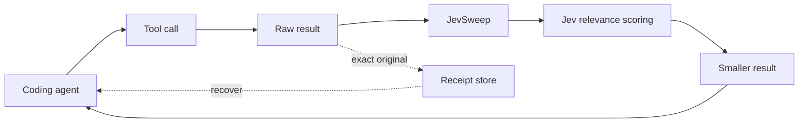

<h1 align="center">JevSweep</h1>

<p align="center"><b>Give coding agents less to read.</b><br>
JevSweep uses Jev to remove low-value tool output before it reaches the coding model, while keeping every removed result exactly recoverable.</p>

<p align="center">

</p>

## How it works

1. **Capture.** When the agent runs a tool like `grep`, `read_file`, or a shell command, JevSweep stores the original result before changing anything.

2. **Protect.** Errors, tracebacks, test results, exit statuses, structured output, and other important context are kept automatically.

3. **Score.** The remaining output is split into chunks. Jev scores whether each chunk still matters to the current task.

4. **Prune.** Low-value chunks are removed before the coding model sees them. Each removed section points back to a receipt containing the exact original text.

```text
coding agent
     |
     v
  tool call
     |
     v
 raw result ---------> receipt
     |
     v
 protect + chunk
     |
     v
     Jev
 KEEP / DROP
     |
     v
smaller result
     |
     v
 coding model
```

JevSweep also includes transcript compaction for longer sessions. Old tool calls can be kept, shortened, or removed based on whether they still matter.

Nothing is summarized or rewritten.

## System design

Jev only makes relevance decisions. It does not write code, choose tools, execute commands, or control the agent.



For live pruning, JevSweep keeps the beginning and end of an observation and automatically protects chunks containing signals such as errors, warnings, tracebacks, test totals, exit statuses, and artifact paths.

Structured documents such as valid JSON and unified diffs pass through unchanged rather than being partially cut.

If Jev fails, returns an invalid response, or the reduction is too small to be useful, the original result passes through untouched.

## Results

I tested live pruning on 10 real Python GitHub issues from Click, Responses, Luigi, AWS Lambda Powertools, Flask, and Babel.

The baseline and JevSweep used the same coding model, issue prompts, repository commits, tools, turn limits, and hidden graders.

| | Baseline | JevSweep |
|---|---:|---:|
| Verified fixes | 5 / 10 | **5 / 10** |
| Tool output sent to model | 60,844 | **38,791** |
| Uncached model input | 69,094 | **51,955** |
| Coding-model input | 622,586 | **435,221** |
| Total coding-model tokens | 641,288 | **454,816** |
| Agent turns | 137 | **137** |
| Tool calls | 129 | **127** |

JevSweep cut the amount of tool output sent to the coding model by **36.2%** while matching the baseline at **5/10 verified fixes**.

Uncached coding-model input fell **24.8%**.

Total coding-model token usage was **29.1% lower** in this run, although total input is more sensitive to differences in agent trajectories than the direct tool-output measurement.

Full results: [`benchmarks/results/four-condition-2026-09-21-tuned.md`](benchmarks/results/four-condition-2026-09-21-tuned.md).

## What got pruned

Across the live-pruning benchmark, JevSweep processed 204 tool results.

- 103 were below the size threshold and passed through
- 33 did not have enough chunks to prune
- 33 were scored and kept in full
- **22 were pruned**
- 7 hit gateway failures and failed open
- 6 were structured documents and were intentionally skipped

The agent made **zero recovery requests** for removed context during the benchmark.

## Transcript compaction

Live pruning reduces new context as it enters the agent.

Transcript compaction handles context that has already accumulated.

Once a transcript becomes large enough, old tool calls are converted into compact descriptors containing information such as the tool name, arguments, result status, output size, preview, and age.

Jev then decides whether each old result should be:

```text
KEEP       keep the full result
TRUNCATE   keep the call and a short part of the result
DROP       remove the old call and result
```

Jev only sees the compact descriptors, not every full historical result.

The production compaction threshold is currently 20,000 estimated transcript tokens.

The real GitHub benchmark never reached that threshold, so the results above measure **live pruning only**. Transcript compaction is implemented and tested separately but still needs a longer real-agent evaluation.

## Recoverability

Every raw result is stored before pruning.

When context is removed, JevSweep inserts a receipt handle pointing back to the exact original text.

```text
[lines 240-410 omitted: cl_RECEIPT_ID]
```

The agent or user can recover it later:

```bash
contextlens recover cl_RECEIPT_ID \
  --receipts .contextlens/receipts
```

Pruning therefore changes what the coding model sees by default without destroying the underlying observation.

## Run it

Python 3.12+.

```bash
python -m pip install -e .
```

Set a Vercel AI Gateway key for Jev:

```bash
export AI_GATEWAY_API_KEY="..."
```

Prune command output:

```bash
pytest -q 2>&1 | contextlens prune \
  --task "fix the failing parser test" \
  --tool shell
```

Compact an existing transcript:

```bash
contextlens compact \
  --transcript transcript.json \
  --json
```

Recover removed context:

```bash
contextlens recover cl_RECEIPT_ID \
  --receipts .contextlens/receipts
```

Run JevSweep over MCP:

```bash
contextlens mcp \
  --task "fix the failing parser test" \
  --receipts .contextlens/receipts
```

Without a Jev gateway key, pruning and compaction fail open and return the original context.

## Benchmark it

The paired benchmark runs the same frozen coding tasks under multiple context conditions.

```bash
export OPENAI_API_KEY="..."
export AI_GATEWAY_API_KEY="..."

python -m pip install uv

python -m benchmarks.run \
  --output benchmarks/artifacts/paired \
  --trials 1 \
  --timeout 300
```

The benchmark uses frozen real GitHub issues and hidden graders so the context layer changes without changing the task itself.

An offline harness is also included for testing the pruning and compaction paths without calling a coding model:

```bash
python -m benchmarks.offline \
  --output benchmarks/results/offline.json
```

## Repository

| Folder | What's in it |
|---|---|
| [`src/contextlens/`](src/contextlens/) | live pruning, transcript compaction, Jev client, receipts, CLI, MCP |
| [`benchmarks/`](benchmarks/) | frozen GitHub tasks and paired evaluation harness |
| [`tests/`](tests/) | pruning, compaction, recovery, CLI, MCP, and benchmark tests |
| [`docs/`](docs/) | architecture and experiment history |
| [`experiments/`](experiments/) | retired approaches |

## Credits

Live tool-output pruning is based on Tamara Tran's [`jev-pruner`](https://github.com/tamaratran/jev-pruner).

Transcript compaction builds on [`fast-jev-compaction`](https://github.com/tamaratran/fast-jev-compaction).

Jev is built by [TypeSafe AI](https://www.typesafe.ai) and accessed through the [Vercel AI Gateway](https://vercel.com/ai-gateway/models/jev).

Benchmark tasks come from [Click](https://github.com/pallets/click), [Responses](https://github.com/getsentry/responses), [Luigi](https://github.com/spotify/luigi), [AWS Lambda Powertools](https://github.com/aws-powertools/powertools-lambda-python), [Flask](https://github.com/pallets/flask), and [Babel](https://github.com/python-babel/babel), including two tasks from [SWE-bench-Live](https://github.com/SWE-bench/SWE-bench-Live).

Released under the [MIT License](LICENSE).
