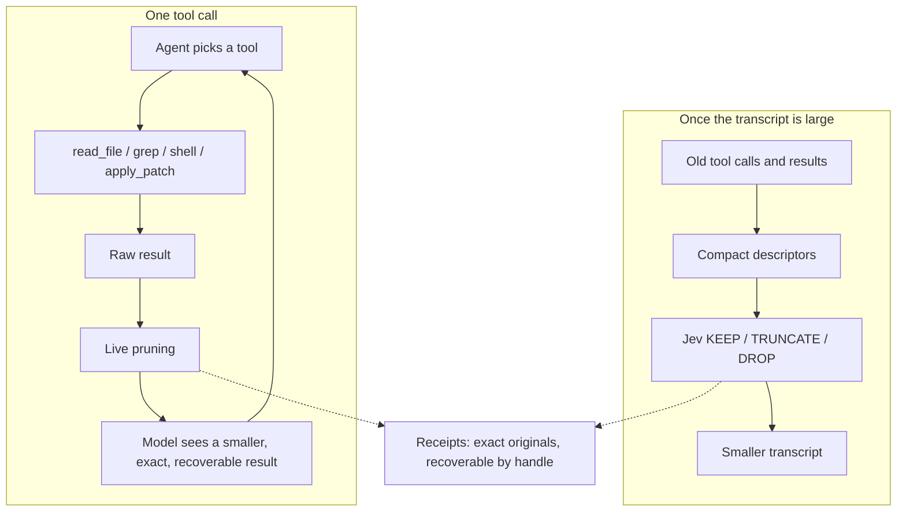

# ContextLens

A transparent context-reduction layer for coding agents.

Two things, both driven by cheap Jev relevance decisions. Large tool results are
pruned before the coding model reads them, and stale tool calls are garbage
collected out of a long transcript. Nothing is summarized, nothing is rewritten,
and everything removed stays exactly recoverable.

```text
Live pruning:           tool output -> Jev KEEP/DROP -> model
Transcript compaction:  old transcript -> Jev KEEP/TRUNCATE/DROP -> smaller transcript
```

## How it works

### Live pruning

```text
coding agent -> tool call -> raw tool result -> ContextLens -> smaller result -> coding model
```

1. **Record.** The raw result is written to a receipt before anything else, so
   it is recoverable even when nothing is pruned.
2. **Gate.** Output under the configurable minimum-size threshold passes
   through untouched. So does binary output, valid JSON, and unified diffs:
   cutting a hole in a machine-readable document leaves something that looks
   complete but is not.
3. **Chunk.** The output is split into line chunks, capped at 200, with very
   long lines split first.
4. **Protect deterministically.** The first and last chunks always survive, as
   does any chunk holding a recognized error, warning, traceback, test total,
   exit status, or artifact path -- or sitting next to one. No model is asked.
5. **Ask Jev.** One KEEP/DROP question per remaining chunk, batched so Jev's
   input stays bounded. A chunk also survives when its probability is merely
   uncertain, or when it was never scored. Removal requires confidence.
6. **Render.** Kept chunks are joined verbatim. Each run of dropped chunks
   becomes one marker naming the omitted line range and the receipt handle.

### Transcript compaction

When the transcript grows past a threshold, old tool calls and their results
become compact descriptors -- tool name, arguments, success or failure, output
size, a short preview, relative age -- and Jev answers two questions about each:
does the call still matter, and does its full result still need to stay
verbatim. Those two probabilities map to one deterministic action:

```text
KEEP       keep the tool call and its full result
TRUNCATE   keep the call, keep a short prefix and metadata of the result
DROP       remove the call together with its result
```

Jev never sees the results themselves, only descriptors, so the request stays
bounded however long the session runs.

### What Jev does not do

Jev makes relevance decisions and nothing else. It does not choose the agent's
next action, generate code, write commands, execute tools, create plans,
summarize the task, or manage the agent loop. Neither layer adds a
frontier-model turn: live pruning runs on the tool-response path, and compaction
rewrites a transcript the host already owns.

Every failure path fails open. A missing key, a gateway error, a malformed or
missing answer, a state that will not fit, or a reduction too small to be worth
it all return the original text unchanged.

## System design



The production surface is seven files:

| File | Responsibility |
| --- | --- |
| [`filtering.py`](src/contextlens/filtering.py) | Live pruning of one tool result |
| [`compaction.py`](src/contextlens/compaction.py) | Relevance-based garbage collection over a transcript |
| [`jev.py`](src/contextlens/jev.py) | Gateway, strict response validation, question batching, usage accounting |
| [`receipts.py`](src/contextlens/receipts.py) | Content-addressed store for originals; exact recovery |
| [`models.py`](src/contextlens/models.py) | Transcript and observation types, token estimates |
| [`cli.py`](src/contextlens/cli.py) | `prune`, `compact`, `recover`, `mcp` |
| [`mcp.py`](src/contextlens/mcp.py) | `context_prune` and `context_recover` over stdio |

`filtering.py` and `compaction.py` do not depend on each other. A host can use
either alone. Protected conservatively and never touched by compaction: the
original user task, the newest messages, host-pinned content such as explicit
user constraints, every edit, and recent failures. See
[`docs/architecture.md`](docs/architecture.md).

## Results

### Measured four-condition run, 21 September 2026

Ten frozen real Python GitHub issues (Click, responses, Luigi, Powertools,
Flask, Babel), two from SWE-bench-Live. `gpt-5.6-luna` at
`reasoning.effort=low`, 20 turns, 300 s, one trial. All four conditions share
the coding model, reasoning effort, issue prompt, repository commit, tool set,
timeout, turn limit, and hidden grader; only the ContextLens layers differ. The
agent is never told ContextLens exists. Hidden graders calibrated 10/10; 39 of
40 attempts completed (one baseline attempt hit the turn limit). Jev scored
through the Vercel AI Gateway; coding-model calls went to OpenAI.

| Condition | Live pruning | Compaction |
| --- | --- | --- |
| `baseline` | no | no |
| `live_pruning` | yes | no |
| `compaction_only` | no | yes |
| `full_contextlens` | yes | yes |

| Condition | Verified Fixes | Coding Input | Uncached | Cached | Output | Total Coding | Raw Tool Output | Injected Tool Output | Tokens Removed | Agent Turns | Tool Calls | Compaction Events | Tasks Compacted | Recoveries | Jev Input | Jev Output | Jev Cost | Wall Clock |
| --- | ---: | ---: | ---: | ---: | ---: | ---: | ---: | ---: | ---: | ---: | ---: | ---: | ---: | ---: | ---: | ---: | ---: | ---: |
| Baseline | 5 | 463,023 | 55,593 | 407,430 | 17,974 | 480,997 | 44,533 | 44,533 | 0 | 135 | 126 | 0 | 0 | 0 | 0 | 0 | 0 | 403.3 s |
| Live Pruning | 5 | 447,362 | 61,704 | 385,658 | 16,283 | 463,645 | 55,279 | 53,798 | 1,481 | 120 | 110 | 0 | 0 | 0 | 22,079 | 799 | 0 | 327.6 s |
| Compaction Only | 7 | 476,918 | 53,818 | 423,100 | 17,177 | 494,095 | 56,801 | 56,801 | 0 | 117 | 107 | 0 | 0 | 0 | 0 | 0 | 0 | 390.1 s |
| Full ContextLens | 5 | 479,354 | 61,744 | 417,610 | 19,207 | 498,561 | 53,426 | 52,743 | 683 | 127 | 117 | 0 | 0 | 0 | 19,105 | 512 | 0 | 353.1 s |

| Metric vs Baseline | Live Pruning | Compaction Only | Full ContextLens |
| --- | ---: | ---: | ---: |
| Verified fixes | +0 | +2 | +0 |
| Coding-model input tokens | -15,661 (-3.4%) | +13,895 (+3.0%) | +16,331 (+3.5%) |
| Uncached coding-model input | +6,111 (+11.0%) | -1,775 (-3.2%) | +6,151 (+11.1%) |
| Cached coding-model input | -21,772 (-5.3%) | +15,670 (+3.8%) | +10,180 (+2.5%) |
| Output tokens | -1,691 (-9.4%) | -797 (-4.4%) | +1,233 (+6.9%) |
| Total coding-model tokens | -17,352 (-3.6%) | +13,098 (+2.7%) | +17,564 (+3.7%) |
| Raw tool output | +10,746 (+24.1%) | +12,268 (+27.5%) | +8,893 (+20.0%) |
| Injected tool output | +9,265 (+20.8%) | +12,268 (+27.5%) | +8,210 (+18.4%) |
| Agent turns | -15 (-11.1%) | -18 (-13.3%) | -8 (-5.9%) |
| Tool calls | -16 (-12.7%) | -19 (-15.1%) | -9 (-7.1%) |
| Wall clock | -75.7 s (-18.8%) | -13.2 s (-3.3%) | -50.2 s (-12.4%) |

| Task | Base | Live | Compact | Full | Base Input | Live Input | Compact Input | Full Input |
| --- | --- | --- | --- | --- | ---: | ---: | ---: | ---: |
| aws-powertools-eventbridge-replay | ✅ | ❌ | ✅ | ❌ | 26,084 | 57,670 | 77,805 | 52,262 |
| aws-powertools-query-merge | ❌ | ❌ | ❌ | ❌ | 82,705 | 58,357 | 41,511 | 98,385 |
| click-empty-default | ❌ | ❌ | ❌ | ❌ | 40,411 | 34,185 | 40,033 | 34,293 |
| click-short-help | ❌ | ❌ | ❌ | ❌ | 19,518 | 31,285 | 24,670 | 35,513 |
| pallets-flask-trusted-hosts | ❌ | ✅ | ✅ | ✅ | 80,186 | 88,309 | 96,772 | 69,388 |
| python-babel-parse-time | ✅ | ✅ | ✅ | ✅ | 42,228 | 28,888 | 27,450 | 23,725 |
| responses-blank-query | ✅ | ✅ | ✅ | ✅ | 22,653 | 29,837 | 16,977 | 21,893 |
| responses-query-mutation | ✅ | ❌ | ✅ | ✅ | 19,953 | 17,913 | 28,659 | 32,162 |
| spotify-luigi-bool-default | ✅ | ✅ | ✅ | ✅ | 47,921 | 42,532 | 42,302 | 32,301 |
| spotify-luigi-run-arguments | ❌ | ✅ | ✅ | ❌ | 81,364 | 58,386 | 80,739 | 79,432 |

Regressions, where baseline fixed a task and a ContextLens condition did not:

- **Live Pruning** — 2: `aws-powertools-eventbridge-replay`,
  `responses-query-mutation`. Newly fixed: `pallets-flask-trusted-hosts`,
  `spotify-luigi-run-arguments`.
- **Compaction Only** — none. Newly fixed: `pallets-flask-trusted-hosts`,
  `spotify-luigi-run-arguments`.
- **Full ContextLens** — 1: `aws-powertools-eventbridge-replay`. Newly fixed:
  `pallets-flask-trusted-hosts`.

Full report:
[`benchmarks/results/four-condition-2026-09-21.md`](benchmarks/results/four-condition-2026-09-21.md).

### Earlier run, previous architecture

The 21 September run that retired AST structural expansion measured Baseline
**583,459** coding-model input tokens and 5/10 fixes, Jev filtering alone
**379,716** and 7/10, and Jev filtering plus AST expansion **1,105,615** and
5/10. That filtering condition used a lower minimum-size threshold and removed
**21,356** tool-output tokens, which is why it showed a large input reduction the
run above does not reproduce. Full report:
[`docs/history/coding-agent-2026-09-21.md`](docs/history/coding-agent-2026-09-21.md).

### Offline harness check

What can be measured without credentials: a scripted solver replays one fixed
tool sequence against a synthetic repository, and a local heuristic answers the
relevance questions in Jev's place.

| Condition | Raw Tool Output | Injected Tool Output | Removed | Compaction Events | Compaction Tokens Removed | Final Transcript |
| --- | ---: | ---: | ---: | ---: | ---: | ---: |
| Baseline | 6,587 | 6,587 | 0 | 0 | 0 | 6,753 |
| Live Pruning | 6,587 | 477 | 6,110 (92.76%) | 0 | 0 | 643 |
| Compaction Only | 6,587 | 6,587 | 0 | 1 | 3,275 | 3,478 |
| Full ContextLens | 6,587 | 477 | 6,110 (92.76%) | 1 | 250 | 393 |

Tool calls (6) and agent turns (7) are identical across all four conditions, by
construction. Each layer reduces context on its own and they compose. This
exercises the layers and the report; it runs no coding model, so it says nothing
about task success or frontier-model savings, and its compaction trigger is
deliberately lowered because the scripted transcript is tiny. Raw rows:
[`benchmarks/results/offline.json`](benchmarks/results/offline.json).

## What the numbers mean

The honest reading of the four-condition run: **at their default thresholds,
neither layer engaged enough on these tasks to move the coding model's token
count, so this run does not show ContextLens reducing context.** It also does
not show it costing fixes. Both layers were effectively idle.

- **Transcript compaction never fired.** Zero events across all 20 attempts in
  the two compaction conditions. The largest transcript in the whole run reached
  **14,022** estimated tokens against the production trigger of **20,000**, with
  a median around **5,600**. Twenty turns on a single-file bug fix simply does
  not produce a long transcript. The threshold was not lowered to force it.
- **Therefore `compaction_only` was mechanically identical to `baseline`** — same
  raw tool output, no pruning, no compaction — and it still scored **7/10 against
  baseline's 5/10**, differing by **+3.0%** coding-model input. That is the most
  useful number in the run: it measures the noise floor of this suite directly.
  A ±2 fix swing and a ±3% token swing here mean nothing. Read every other
  comparison against that.
- **Live pruning barely fired.** It requested Jev on 3 of 10 tasks (4 requests
  total) and removed **1,481 of 55,279** raw tool-output tokens, **2.7%**. The
  cause is mechanical: the average tool result was about **500 tokens** against
  the **1,500-token** minimum-size gate, so almost nothing was eligible. Its
  -3.4% coding-model input is inside the noise floor above, not a saving.
- **Injected tool output rose in every candidate condition** (+18% to +28%).
  ContextLens cannot add text, and it removed tokens where it ran. Those agents
  simply took different, longer tool sequences — visible in raw tool output
  rising by a nearly identical amount. This is trajectory variance.
- **Jev is cheap and separate.** 22,079 input / 799 output tokens for live
  pruning, 19,105 / 512 for full ContextLens, gateway-reported cost 0, and never
  added to coding-model input in any table.
- **No recovery was ever needed.** 0 recovery calls in every condition, so the
  pruning that did happen never removed something the agent had to ask for back.
- **Wall clock fell in every candidate condition** (-3% to -19%), tracking the
  lower turn and tool-call counts rather than anything ContextLens did.
- The earlier run's **-34.9%** input reduction came from a filtering condition
  with a lower size gate that removed **21,356** tool-output tokens, 14× more
  than live pruning removed here. The reduction was real; the current default
  threshold is what prevents reproducing it.
- **AST structural expansion** remains retired: **+522,156** input tokens
  (+89.5%) against baseline, driven by two runaway trajectories
  (`click-short-help` 490,067, `spotify-luigi-run-arguments` 264,521). See
  [`experiments/structural_expansion/`](experiments/structural_expansion/).
- **A `context_next` loop** in which Jev chose the agent's next capability kept
  2/3 verified fixes, timed out once, and used 156.21% more complete input.
  Deciding for the agent cost input and turns, which is why Jev only decides
  relevance.

**Answer to the main question, as measured:** on ten single-file Python bug
fixes at 20 turns, ContextLens neither reduced the tokens the coding model
processed nor cost verified fixes, because its triggers are set for workloads
with far more tool output and far longer transcripts than these tasks produce.
The next step is not to tune thresholds until the table looks better — it is to
measure on a workload that actually generates large tool outputs and long
sessions, and to report threshold sensitivity as its own labelled experiment.
One trial of ten tasks is not a statistical claim in either direction.

## Run it

Python 3.12+, no runtime dependencies.

```bash
python -m pip install -e .
```

Live pruning and compaction need a Vercel AI Gateway key. Without one both fail
open and return the original text:

```bash
export AI_GATEWAY_API_KEY="your-vercel-ai-gateway-key"

pytest -q 2>&1 | contextlens prune --task "fix the failing parser test" --tool shell
contextlens compact --transcript transcript.json --json
contextlens recover cl_RECEIPT_ID --receipts .contextlens/receipts
contextlens mcp --task "fix the failing parser test" --receipts .contextlens/receipts
```

Vercel Pro and Enterprise users can set `CONTEXTLENS_VERCEL_ZDR=1` for
zero-data-retention routing. Thresholds are configurable through
`CONTEXTLENS_MIN_TOKENS`, `CONTEXTLENS_CHUNK_LINES`,
`CONTEXTLENS_KEEP_THRESHOLD`, and `CONTEXTLENS_MAX_STATE_TOKENS`.

The four-condition paired coding-agent benchmark, and the offline harness check
that needs no credentials. Nine of the ten hidden graders shell out to `uv`:

```bash
export OPENAI_API_KEY="..."
export AI_GATEWAY_API_KEY="..."
python -m pip install uv
python -m benchmarks.run --output benchmarks/artifacts/paired --trials 1 --timeout 300

python -m benchmarks.offline --output benchmarks/results/offline.json
```

Development:

```bash
python -m pip install -e ".[dev]"
pytest
ruff check .
mypy
mypy --ignore-missing-imports benchmarks tests
```

| Folder | What's in it |
| --- | --- |
| [`src/contextlens/`](src/contextlens/) | The two layers, the Jev client, receipts, CLI, MCP |
| [`tests/`](tests/) | Pruning, compaction, recovery, CLI, MCP, and benchmark coverage |
| [`benchmarks/`](benchmarks/) | Frozen coding-agent tasks, the paired harness, the offline check |
| [`docs/`](docs/) | [Architecture](docs/architecture.md) and [history](docs/history/) |
| [`experiments/`](experiments/) | Retired research, not imported by the package |

Released under the [MIT License](LICENSE).

## Credits

The two layers are modelled directly on Tamara Tran's work:
[fast-jev-compaction](https://github.com/tamaratran/fast-jev-compaction) for
descriptor-based transcript compaction, and
[jev-pruner](https://github.com/tamaratran/jev-pruner) for pruning live tool
output. The token estimator, the staged state fitting, the uncertainty
safeguard, and the two-question decision table all come from there.

Jev by [TypeSafe AI](https://www.typesafe.ai) through the
[Vercel AI Gateway](https://vercel.com/ai-gateway/models/jev). Frozen tasks from
[Click](https://github.com/pallets/click),
[responses](https://github.com/getsentry/responses),
[Luigi](https://github.com/spotify/luigi),
[Powertools](https://github.com/aws-powertools/powertools-lambda-python),
[Flask](https://github.com/pallets/flask), and
[Babel](https://github.com/python-babel/babel), two of them from
[SWE-bench-Live](https://github.com/SWE-bench/SWE-bench-Live).
