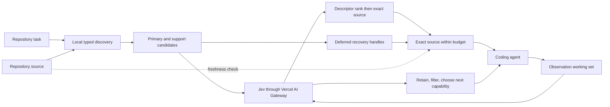

# ContextLens

Jev decides what evidence and capability a coding agent should use next.

ContextLens is an experimental context and action controller for coding agents.
It combines local repository structure with TypeSafe AI's Jev to choose
repository evidence, keep useful observations active, filter offered
capabilities, and select one bounded next action. Jev runs through the Vercel AI
Gateway. The coding model still owns reasoning, command arguments, edits, and
execution.

The completed controller is functional, but it is not a default to run before
every tool call. A paired coding-agent pilot preserved 2/3 verified fixes and
used **156.21% more complete input** after Jev overhead. Use it where a decision
is actually needed.

## How it works

1. **Discover.** A local structural index finds functions, methods, declarations,
   tests, and configuration related to the task. Whole files stay out of the
   request unless they are the smallest useful unit.
2. **Rank.** Jev scores compact evidence descriptors first, then evaluates a
   smaller exact-source shortlist. Only typed actions supplied by the host are
   eligible later.
3. **Read.** ContextLens returns exact source for selected implementations.
   Structural support such as class headers and referenced constants follows the
   selected primary code while the response remains inside its token budget.
4. **Observe.** Results enter a recoverable working set. Observations can be
   pinned, kept, or deferred. Pinned items and user constraints stay active when
   provider limits drop other descriptors.
5. **Decide.** Jev retains or defers compact observation descriptors, filters the
   offered capability set while keeping recovery paths, and chooses one next
   action. That choice is a capability, not an executed tool.
6. **Recover.** Deferred source and observations remain available through stable
   handles. Freshness checks stop changed source from being presented as current.

Local code owns source identity, exact ranges, budgets, freshness, recovery, and
validation. Jev owns relevance, retention, and bounded-choice judgments.

## System design



Vercel Pro and Enterprise users can require zero-data-retention routing with
`CONTEXTLENS_VERCEL_ZDR=1`. Vercel rejects that option on Hobby plans.

## MCP tools

The default `jev` profile exposes these stdio tools. `context_next` never
executes an action. Host-supplied tool names are advisory only and are stripped
at the MCP boundary.

| Tool | Role | Mutates state |
| --- | --- | --- |
| `context_select` | Jev-selected exact source for a task | No |
| `context_read` | Current source by handle or path, with freshness checks | No |
| `context_expand` | Historical snapshot by handle, not an edit target | No |
| `context_observe` | Save a recoverable observation; may pin it | Yes |
| `context_working_set` | List compact active and deferred descriptors | No |
| `context_recall` | Restore an exact deferred observation | Yes |
| `context_next` | Retain, filter capabilities, and choose one next action | Yes |

`context_next` records complete controller usage across retention, capability
filtering, and the action decision. Coding-agent source uptake is counted
separately from those Jev calls.

Direct `context_read` calls do not need a gateway key. Selection, retention,
capability filtering, and next-action decisions do.

## Results

Five fixed component cases test functions, methods, transitive support, gateway
validation, and scope analysis. Every required source anchor was present and none
of the fixture noise anchors appeared.

| Case | Evidence | Full file | Selected source | Reduction |
| --- | --- | ---: | ---: | ---: |
| Function with constant support | Passed | 3,041 | 220 | 92.8% |
| Method with class support | Passed | 1,250 | 209 | 83.3% |
| Function with transitive support | Passed | 3,047 | 218 | 92.8% |
| Gateway response validation | Passed | 1,140 | 1,945 | -70.6% |
| Scope declaration analysis | Passed | 3,726 | 1,226 | 67.1% |
| **Total** | **5/5 passed** | **12,204** | **3,818** | **68.7%** |

Jev used 34,405 input tokens and 1,560 output tokens to make those decisions.
Vercel reported `$0` total cost; mean gateway latency was 434 ms. The selected
source is smaller, but the complete system used more input than the full-file
baseline. This is evidence-quality validation, not a whole-system savings claim.

Descriptor-first selection later reduced Jev decision input by 28.6% on the same
five cases while preserving 5/5 evidence passes. The bounded action benchmark
selected the known useful action in 6/6 fixed cases. The integrated working-set
loop selected 3/3 known next actions across eight Jev calls, using 4,179 input
and 437 output tokens with no provider fallback.

The completed controller was then tested in a three-task paired coding pilot.
Baseline and control each produced 2/3 verified fixes, but one control attempt
timed out. Across the two complete pairs, control used **156.21% more input**
after including 25,860 Jev decision tokens. Controller uptake is measured by
actual `context_next` use, not only source reads. This fails the end-to-end
savings gate.

An earlier nine-pair coding-agent pilot used the older compact search/read flow.
Both conditions produced 7/9 correct fixes, while ContextLens used 24.12% more
input and had one paired quality regression. That result motivated the Jev-first
architecture; it is not a result for the current controller.

[Jev benchmark analysis](docs/jev-benchmark-2026-09-20.md) ·
[raw Jev results](benchmarks/results/jev-selection-2026-09-20.json) ·
[descriptor benchmark](docs/jev-descriptor-benchmark-2026-09-20.md) ·
[action benchmark](docs/action-selection-benchmark-2026-09-20.md) ·
[controller loop benchmark](docs/controller-loop-benchmark-2026-09-20.md) ·
[controller trajectory analysis](docs/controller-trajectory-benchmark-2026-09-20.md) ·
[older whole-agent pilot](benchmarks/results/goal-e2e-2026-09-18/README.md)

## What made it work

- **Primary code before support.** A large dependency group cannot crowd a small
  answer-bearing implementation out of the response.
- **Precise spans before broad parents.** If both a method and its class are
  relevant, ContextLens prefers the method and adds only needed class structure.
- **Descriptors before exact source.** Broad ranking uses compact unit metadata;
  only a shortlist pays the cost of full source.
- **A model decision with local guardrails.** Jev judges relevance and the next
  capability; deterministic code still enforces exact source, response budgets,
  provider validation, freshness, and recovery.
- **Recovery instead of silent truncation.** Bounded deferred handles make omitted
  evidence explicit and readable without repeating every candidate.
- **Pinned observations under limits.** User constraints and pinned items stay in
  the decision state when other descriptors are dropped.
- **Capabilities, not executed tools.** `context_next` chooses among host-offered
  kinds such as `search_repository`, `read_source`, `run_targeted_test`, and
  `ready_to_edit`. Recovery kinds stay available after capability filtering.

These are component results plus one small paired pilot. The current policy is
sparse controller invocation, not a mandatory decision before every operation.

## Run it

Requires Git, Python 3.12+, and a Vercel AI Gateway key for Jev decisions.

```powershell
python -m pip install -e .
$env:AI_GATEWAY_API_KEY = "your-vercel-ai-gateway-key"
contextlens select --root . --task "fix the refresh-token timeout"
```

The response contains exact source and deferred handles. Read a handle or known
range directly when more context is needed:

```powershell
contextlens read --root . --handle h_REPLACE_WITH_RETURNED_HANDLE
contextlens read --root . --path src/auth.py --start-line 20 --end-line 60
```

Expose selection, bounded next-action routing, and recoverable working sets to an
MCP-compatible coding agent:

```powershell
contextlens mcp --root . --state .contextlens --encoding o200k_base
```

Run the live component and trajectory benchmarks:

```powershell
python -m benchmarks.jev_selection `
  --root . `
  --output benchmarks/results/jev-selection.json

python -m benchmarks.controller_loop `
  --output benchmarks/results/controller-loop.json

python -m benchmarks.goal `
  --candidate-policy control `
  --output evals/artifacts/controller-trajectory `
  --trials 1 `
  --timeout 240
```

The default install contains the parsers and tokenizer used by the Jev workflow.
Install `.[neural]` only for the older neural experiments. Legacy retrieval and
MCP tools remain available through `retrieve` and `mcp --profile legacy`.

## Develop it

```powershell
python -m pip install -e ".[dev]"
python -m pytest -q
ruff check src tests
mypy
```

| Folder | What's in it |
| --- | --- |
| [`src/contextlens/`](src/contextlens/) | Jev gateway, selection, working sets, capability filtering, MCP server, and legacy experiments |
| [`tests/`](tests/) | Coverage for selection, retention, recovery, freshness, MCP, and provider validation |
| [`benchmarks/`](benchmarks/) | Component, controller-loop, and paired coding-agent evaluation harnesses |
| [`docs/`](docs/) | Architecture, research assessment, protocols, and measured reports |
| [`schemas/`](schemas/) | Context policy and evaluation report schemas |
| [`examples/`](examples/) | Example policies and integrations |

## Credits

Jev is built by [TypeSafe AI](https://www.typesafe.ai/) and accessed through the
[Vercel AI Gateway](https://vercel.com/ai). ContextLens is released under the
[MIT License](LICENSE).
