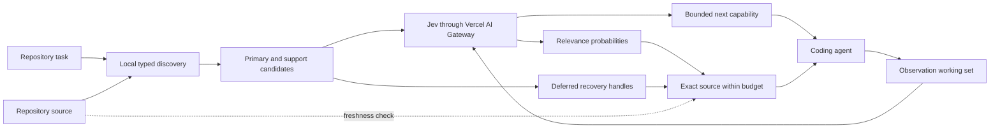

# ContextLens

Jev decides what evidence and capability a coding agent should use next.

ContextLens is a context and action controller for coding agents. It combines
local repository structure with TypeSafe AI's Jev to choose repository evidence,
select one bounded next capability, and keep useful observations active. Jev runs
through the Vercel AI Gateway.

## How it works

1. **Discover.** A local structural index finds functions, methods, declarations,
   tests, and configuration related to the task. Whole files stay out of the
   request unless they are the smallest useful unit.
2. **Decide.** Jev ranks compact evidence descriptors, evaluates a smaller exact
   source shortlist, and chooses only among typed actions supplied by the host.
3. **Read.** ContextLens returns exact source for selected implementations.
   Structural support such as class headers and referenced constants follows the
   selected primary code while the response remains inside its token budget.
4. **Continue.** Results enter a recoverable working set. Jev can retain or defer
   compact observation descriptors before choosing the next capability again.
5. **Recover.** Deferred source and observations remain available through stable
   handles. Freshness checks stop changed source from being presented as current.

The coding model still owns reasoning, command arguments, edits, and execution.
ContextLens makes bounded context and capability decisions; local code validates
identifiers, source, budgets, and recovery.

## System design



Local code owns source identity, exact ranges, budgets, freshness, and recovery.
Jev owns relevance, retention, and bounded-choice judgments. Vercel Pro and Enterprise users can require
zero-data-retention routing with `CONTEXTLENS_VERCEL_ZDR=1`; Vercel rejects that
option on Hobby plans.

## Results

Five fixed component cases test functions, methods, transitive support, gateway
validation, and scope analysis. Every required source anchor was present and none
of the fixture noise anchors appeared.

| Case | Evidence | Full file | Selected source | Reduction |
| --- | --- | ---: | ---: | ---: |
| Function with constant support | Passed | 3,041 | 220 | 92.8% |
| Method with class support | Passed | 1,250 | 209 | 83.3% |
| Function with transitive support | Passed | 3,047 | 218 | 92.8% |
| Gateway response validation | Passed | 1,140 | 1,945 | -70.6% |
| Scope declaration analysis | Passed | 3,726 | 1,226 | 67.1% |
| **Total** | **5/5 passed** | **12,204** | **3,818** | **68.7%** |

Jev used 34,405 input tokens and 1,560 output tokens to make those decisions.
Vercel reported `$0` total cost; mean gateway latency was 434 ms. The selected
source is smaller, but the complete system used more input than the full-file
baseline. This is evidence-quality validation, not a whole-system savings claim.

An earlier nine-pair coding-agent pilot used the older compact search/read flow.
Both conditions produced 7/9 correct fixes, while ContextLens used 24.12% more
input and had one paired quality regression. That result motivated the Jev-first
architecture; it is not a result for the current selector.

[Jev benchmark analysis](docs/jev-benchmark-2026-09-20.md) ·
[raw Jev results](benchmarks/results/jev-selection-2026-09-20.json) ·
[older whole-agent pilot](benchmarks/results/goal-e2e-2026-09-18/README.md)

## What made it work

- **Primary code before support.** A large dependency group cannot crowd a small
  answer-bearing implementation out of the response.
- **Precise spans before broad parents.** If both a method and its class are
  relevant, ContextLens prefers the method and adds only needed class structure.
- **A model decision with local guardrails.** Jev judges relevance; deterministic
  code still enforces exact source, response budgets, provider validation, and
  freshness.
- **Recovery instead of silent truncation.** Bounded deferred handles make omitted
  evidence explicit and readable without repeating every candidate.

Descriptor-first selection subsequently reduced Jev decision input by 28.6% on
the same five evidence cases while preserving 5/5 evidence passes. The bounded
action benchmark selected the known useful action in 6/6 fixed cases. The
integrated working-set loop selected 3/3 known next actions across eight Jev
calls, using 4,179 input and 437 output tokens with no provider fallback. These
are component results; a paired coding-agent run is still required before making
a whole-trajectory savings or patch-quality claim.

[descriptor benchmark](docs/jev-descriptor-benchmark-2026-09-20.md) ·
[action benchmark](docs/action-selection-benchmark-2026-09-20.md) ·
[controller loop benchmark](docs/controller-loop-benchmark-2026-09-20.md)

## Run it

Requires Git, Python 3.12+, and a Vercel AI Gateway key.

```powershell
python -m pip install -e .
$env:AI_GATEWAY_API_KEY = "your-vercel-ai-gateway-key"
contextlens select --root . --task "fix the refresh-token timeout"
```

The response contains exact source and deferred handles. Read a handle or known
range directly when more context is needed:

```powershell
contextlens read --root . --handle h_REPLACE_WITH_RETURNED_HANDLE
contextlens read --root . --path src/auth.py --start-line 20 --end-line 60
```

Expose selection, bounded next-action routing, and recoverable working sets to an
MCP-compatible coding agent:

```powershell
contextlens mcp --root . --state .contextlens --encoding o200k_base
```

The Jev profile exposes `context_select`, exact source reads, `context_next`, and
observation tools for saving, listing, and recalling the active working set.

Run the live component benchmark:

```powershell
python -m benchmarks.jev_selection `
  --root . `
  --output benchmarks/results/jev-selection.json
```

The default install contains the parsers and tokenizer used by the Jev workflow.
Install `.[neural]` only for the older neural experiments. Legacy retrieval and MCP
tools remain available through `retrieve` and `mcp --profile legacy`.

## Develop it

```powershell
python -m pip install -e ".[dev]"
python -m pytest -q
ruff check src tests
mypy
```

| Folder | What's in it |
| --- | --- |
| [`src/contextlens/`](src/contextlens/) | Jev gateway, selection policy, exact-source tools, MCP server, and legacy experiments |
| [`tests/`](tests/) | Unit and integration coverage for selection, recovery, freshness, and provider validation |
| [`benchmarks/`](benchmarks/) | Reproducible component and coding-agent evaluation harnesses |
| [`docs/`](docs/) | Architecture, research assessment, protocols, and measured reports |
| [`schemas/`](schemas/) | Context policy and evaluation report schemas |
| [`examples/`](examples/) | Example policies and integrations |

## Credits

Jev is built by [TypeSafe AI](https://www.typesafe.ai/) and accessed through the
[Vercel AI Gateway](https://vercel.com/ai). ContextLens is released under the
[MIT License](LICENSE).
