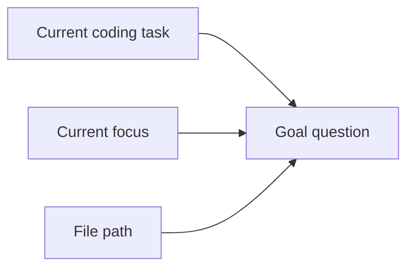
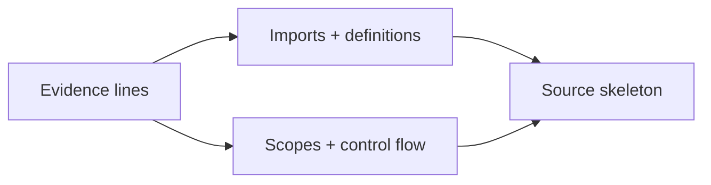
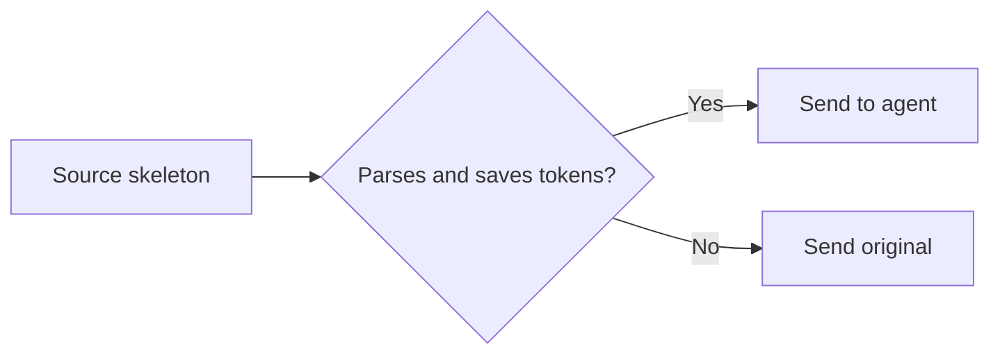

# ContextLens

ContextLens turns the current coding task into a goal question, asks the
released SWE-Pruner 0.6B model which source lines matter, then restores the
Python structure needed to use them. Every original is recoverable.

## See it

```python
# input: client.py
from transport import BaseTransport
from metrics import record_request

class Client(BaseTransport):
    def refresh_token(self, retry):
        record_request("refresh")
        if retry.enabled:
            return self.post("/token", timeout=retry.timeout)
        return self.post("/token")

def unrelated_report():
    ...
```

```bash
contextlens prune \
  --task "Fix the refresh-token timeout" \
  --input client.py
```

```python
from transport import BaseTransport
# [ContextLens cl_0123456789abcdef01234567 omitted original lines 3-4]

class Client(BaseTransport):
    def refresh_token(self, retry):
        # [ContextLens cl_0123456789abcdef01234567 omitted original lines 7-7]
        if retry.enabled:
            return self.post("/token", timeout=retry.timeout)
        return self.post("/token")
# [ContextLens cl_0123456789abcdef01234567 omitted original lines 11-13]
```

The JSON result records the generated goal and why each line survived.

## Architecture

### 1. Create a goal for every read

Following [SWE-Pruner](https://arxiv.org/abs/2601.16746), ContextLens sits
between read tools and the agent.



### 2. Let the 0.6B skimmer choose evidence

Following [SWE-Pruner](https://arxiv.org/abs/2601.16746), the goal and source
are encoded together. Token scores are averaged by line and thresholded.


### 3. Restore structural support

[LaMR](https://arxiv.org/abs/2605.15315) shows why semantic evidence needs
dependency closure. ContextLens traces those dependencies with the Python AST.



### 4. Validate or fall back



Small, unsupported, invalid, and non-saving results pass through unchanged.
Today, pruning handles Python source; other observation types are classified
but bypassed.

## Install

Requires Python 3.12+. Installation includes the official SWE-Pruner runtime
and PyTorch.

```bash
python -m pip install -e ".[dev]"
```

The default model is `ayanami-kitasan/code-pruner`. The first prune downloads
its approximately 1.35 GB checkpoint from Hugging Face. Pin a local copy with:

```bash
hf download ayanami-kitasan/code-pruner --local-dir .contextlens/models/pruner
contextlens prune --model .contextlens/models/pruner \
  --task "Fix the refresh-token timeout" --input client.py
```

An existing SWE-Pruner server remains supported:

```bash
contextlens prune --backend http \
  --backend-url http://127.0.0.1:8000/prune \
  --task "Fix the refresh-token timeout" --input client.py
```

Narrow the query as the agent's focus changes:

```bash
contextlens prune \
  --task "Fix the refresh-token timeout" \
  --focus "Trace retry options passed to the request" \
  --tool read_file \
  --argument path=client.py \
  --input client.py \
  --json
```

JSON includes line-level reasons, omitted ranges, token reduction, backend,
latency, and receipt ID.

## Recover

```bash
# complete observation
contextlens recover cl_0123456789abcdef01234567

# selected original lines
contextlens recover cl_0123456789abcdef01234567 \
  --start-line 80 --end-line 130
```

Receipts live in `.contextlens/receipts` by default.

## Serve

```bash
contextlens serve --host 127.0.0.1 --port 8765
```

```text
GET  /health
POST /v1/prune
POST /v1/recover
```

The server binds to loopback by default and caps request bodies at 16 MiB.

## Develop

```bash
python -m pytest -q
ruff check src tests
mypy
```

Method references: [SWE-Pruner](https://arxiv.org/abs/2601.16746) and
[LaMR](https://arxiv.org/abs/2605.15315). ContextLens loads the released
SWE-Pruner checkpoint; LaMR-style dependency support is deterministic until a
compatible multi-rubric checkpoint is released.

Released under the [MIT License](LICENSE).
