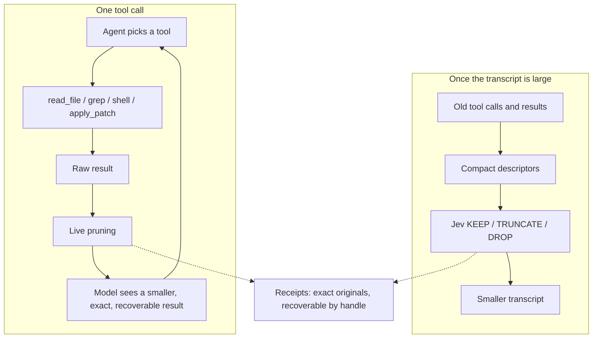

# ContextLens

A transparent context-reduction layer for coding agents.

Two things, both driven by cheap Jev relevance decisions. Large tool results are
pruned before the coding model reads them, and stale tool calls are garbage
collected out of a long transcript. Nothing is summarized, nothing is rewritten,
and everything removed stays exactly recoverable.

```text
Live pruning:           tool output -> Jev KEEP/DROP -> model
Transcript compaction:  old transcript -> Jev KEEP/TRUNCATE/DROP -> smaller transcript
```

## How it works

### Live pruning

```text
coding agent -> tool call -> raw tool result -> ContextLens -> smaller result -> coding model
```

1. **Record.** The raw result is written to a receipt before anything else, so
   it is recoverable even when nothing is pruned.
2. **Gate.** Output under the configurable minimum-size threshold passes
   through untouched. So does binary output, valid JSON, and unified diffs:
   cutting a hole in a machine-readable document leaves something that looks
   complete but is not.
3. **Chunk.** The output is split into line chunks, capped at 200, with very
   long lines split first.
4. **Protect deterministically.** The first and last chunks always survive, as
   does any chunk holding a recognized error, warning, traceback, test total,
   exit status, or artifact path -- or sitting next to one. No model is asked.
5. **Ask Jev.** One KEEP/DROP question per remaining chunk, batched so Jev's
   input stays bounded. A chunk also survives when its probability is merely
   uncertain, or when it was never scored. Removal requires confidence.
6. **Render.** Kept chunks are joined verbatim. Each run of dropped chunks
   becomes one marker naming the omitted line range and the receipt handle.

### Transcript compaction

When the transcript grows past a threshold, old tool calls and their results
become compact descriptors -- tool name, arguments, success or failure, output
size, a short preview, relative age -- and Jev answers two questions about each:
does the call still matter, and does its full result still need to stay
verbatim. Those two probabilities map to one deterministic action:

```text
KEEP       keep the tool call and its full result
TRUNCATE   keep the call, keep a short prefix and metadata of the result
DROP       remove the call together with its result
```

Jev never sees the results themselves, only descriptors, so the request stays
bounded however long the session runs.

### What Jev does not do

Jev makes relevance decisions and nothing else. It does not choose the agent's
next action, generate code, write commands, execute tools, create plans,
summarize the task, or manage the agent loop. Neither layer adds a
frontier-model turn: live pruning runs on the tool-response path, and compaction
rewrites a transcript the host already owns.

Every failure path fails open. A missing key, a gateway error, a malformed or
missing answer, a state that will not fit, or a reduction too small to be worth
it all return the original text unchanged.

## System design



The production surface is seven files:

| File | Responsibility |
| --- | --- |
| [`filtering.py`](src/contextlens/filtering.py) | Live pruning of one tool result |
| [`compaction.py`](src/contextlens/compaction.py) | Relevance-based garbage collection over a transcript |
| [`jev.py`](src/contextlens/jev.py) | Gateway, strict response validation, question batching, usage accounting |
| [`receipts.py`](src/contextlens/receipts.py) | Content-addressed store for originals; exact recovery |
| [`models.py`](src/contextlens/models.py) | Transcript and observation types, token estimates |
| [`cli.py`](src/contextlens/cli.py) | `prune`, `compact`, `recover`, `mcp` |
| [`mcp.py`](src/contextlens/mcp.py) | `context_prune` and `context_recover` over stdio |

`filtering.py` and `compaction.py` do not depend on each other. A host can use
either alone. Protected conservatively and never touched by compaction: the
original user task, the newest messages, host-pinned content such as explicit
user constraints, every edit, and recent failures. See
[`docs/architecture.md`](docs/architecture.md).

## Results

### Measured coding-agent run, 21 September 2026

This is the run that produced the current architecture. It measured the
**previous** architecture, so its labels are the ones used then: "Jev Filter" is
the ancestor of today's live-pruning layer, and "ContextLens" was Jev filtering
plus Python AST expansion. There was no compaction condition.

Ten frozen real Python GitHub issues (Click, responses, Luigi, Powertools,
Flask, Babel), two from SWE-bench-Live. `gpt-5.6-luna` at
`reasoning.effort=low`, 20 turns, 300 s, one trial, identical prompts, tools,
and commits. Hidden graders calibrated 10/10. All 30 paired attempts completed.
Jev scored through the Vercel AI Gateway; coding-model calls stayed on OpenAI.

| Condition | Verified Fixes | Coding Input Tokens | Uncached Input | Cached Input | Output Tokens | Total Coding Tokens | Raw Tool Output | Injected Tool Output | Tokens Removed | Agent Turns | Recoveries | Jev Input |
| --- | ---: | ---: | ---: | ---: | ---: | ---: | ---: | ---: | ---: | ---: | ---: | ---: |
| Baseline | 5 | 583,459 | 67,718 | 515,741 | 14,975 | 598,434 | 46,950 | 46,950 | 0 | 136 | 0 | 0 |
| Jev Filter | 7 | 379,716 | 57,359 | 322,357 | 16,137 | 395,853 | 48,276 | 26,920 | 21,356 | 134 | 0 | 136,505 |
| + AST expansion | 5 | 1,105,615 | 151,696 | 953,919 | 14,989 | 1,120,604 | 138,931 | 119,054 | 19,877 | 141 | 0 | 124,519 |

| Metric | Jev Filter vs Baseline | + AST expansion vs Baseline |
| --- | ---: | ---: |
| Coding-model input tokens | -203,743 (-34.9%) | +522,156 (+89.5%) |
| Uncached coding-model input | -10,359 (-15.3%) | +83,978 (+124.0%) |
| Injected tool output | -20,030 (-42.7%) | +72,104 (+153.6%) |
| Agent turns | -2 (-1.5%) | +5 (+3.7%) |
| Verified fixes | +2 | +0 |

| Task | Baseline | Jev Filter | + AST | Baseline Input | Jev Filter Input | + AST Input |
| --- | --- | --- | --- | ---: | ---: | ---: |
| aws-powertools-eventbridge-replay | ✅ | ✅ | ✅ | 79,418 | 30,005 | 29,772 |
| aws-powertools-query-merge | ❌ | ❌ | ❌ | 125,593 | 80,315 | 79,077 |
| click-empty-default | ❌ | ❌ | ❌ | 61,088 | 30,619 | 34,485 |
| click-short-help | ❌ | ❌ | ❌ | 27,291 | 18,250 | 490,067 |
| pallets-flask-trusted-hosts | ❌ | ✅ | ❌ | 79,769 | 75,477 | 73,710 |
| python-babel-parse-time | ✅ | ✅ | ✅ | 37,987 | 28,294 | 40,720 |
| responses-blank-query | ✅ | ✅ | ✅ | 24,891 | 24,289 | 22,721 |
| responses-query-mutation | ✅ | ✅ | ✅ | 24,342 | 23,998 | 24,796 |
| spotify-luigi-bool-default | ✅ | ✅ | ✅ | 41,709 | 39,789 | 45,746 |
| spotify-luigi-run-arguments | ❌ | ✅ | ❌ | 81,371 | 28,680 | 264,521 |

Full report:
[`docs/history/coding-agent-2026-09-21.md`](docs/history/coding-agent-2026-09-21.md).

### The three-condition run for this architecture has not happened yet

The rebuilt benchmark compares baseline, live pruning, and live pruning plus
compaction. Running it needs an `OPENAI_API_KEY` and an `AI_GATEWAY_API_KEY`,
which the environment this refactor was done in did not have. **No number in
this README was produced by the new three-condition benchmark**, and none has
been invented to stand in for one. The command is below; the report it writes
replaces this section.

### Offline harness check

What can be measured without credentials: a scripted solver replays one fixed
tool sequence against a synthetic repository, and a local heuristic answers the
relevance questions in Jev's place.

| Condition | Raw Tool Output | Injected Tool Output | Removed | Compactions | Final Transcript |
| --- | ---: | ---: | ---: | ---: | ---: |
| Baseline | 6,587 | 6,587 | 0 | 0 | 6,753 |
| Live Pruning | 6,587 | 477 | 6,110 (92.76%) | 0 | 643 |
| Live + Compaction | 6,587 | 477 | 6,110 (92.76%) | 1 | 393 |

Tool calls and agent turns are identical across all three conditions, by
construction. This exercises the two layers and the report; it runs no coding
model, so it says nothing about task success or frontier-model savings. Raw
rows: [`benchmarks/results/offline.json`](benchmarks/results/offline.json).

## What the numbers mean

- **Jev filtering alone used 203,743 fewer coding-model input tokens (-34.9%)**
  than baseline, with two more verified fixes and two fewer agent turns.
  Injected tool output fell from 46,950 to 26,920. That condition is the direct
  ancestor of today's live-pruning layer, and it is why live pruning is the
  default.
- **AST structural expansion used 522,156 more coding-model input tokens
  (+89.5%)** and fixed two fewer tasks than Jev filtering. Two trajectories
  dominate: `click-short-help` reached 490,067 coding-model input tokens against
  a 27,291 baseline, and `spotify-luigi-run-arguments` reached 264,521. It
  still pruned its own raw output (138,931 to 119,054 tokens); the agent simply
  fetched far more. It has been removed from the default path and now lives in
  [`experiments/structural_expansion/`](experiments/structural_expansion/).
- **Jev spend is separate.** 136,505 input / 24,232 output tokens for Jev
  filtering, 124,519 / 21,914 with AST expansion, at a gateway-reported cost of
  0. Jev tokens are never added to coding-model input, in any table.
- **A `context_next` loop** in which Jev chose the agent's next capability kept
  2/3 verified fixes, timed out once, and used 156.21% more complete input on
  finished pairs. Deciding for the agent cost input and turns, which is why Jev
  only decides relevance.
- The 21 September run is **one trial of ten tasks**. It is evidence about
  direction, not a statistical quality claim, and it does not measure the
  compaction layer at all.

## Run it

Python 3.12+, no runtime dependencies.

```bash
python -m pip install -e .
```

Live pruning and compaction need a Vercel AI Gateway key. Without one both fail
open and return the original text:

```bash
export AI_GATEWAY_API_KEY="your-vercel-ai-gateway-key"

pytest -q 2>&1 | contextlens prune --task "fix the failing parser test" --tool shell
contextlens compact --transcript transcript.json --json
contextlens recover cl_RECEIPT_ID --receipts .contextlens/receipts
contextlens mcp --task "fix the failing parser test" --receipts .contextlens/receipts
```

Vercel Pro and Enterprise users can set `CONTEXTLENS_VERCEL_ZDR=1` for
zero-data-retention routing. Thresholds are configurable through
`CONTEXTLENS_MIN_TOKENS`, `CONTEXTLENS_CHUNK_LINES`,
`CONTEXTLENS_KEEP_THRESHOLD`, and `CONTEXTLENS_MAX_STATE_TOKENS`.

The paired coding-agent benchmark, and the offline harness check that needs no
credentials:

```bash
export OPENAI_API_KEY="..."
export AI_GATEWAY_API_KEY="..."
python -m benchmarks.run --output benchmarks/artifacts/paired --trials 1 --timeout 300

python -m benchmarks.offline --output benchmarks/results/offline.json
```

Development:

```bash
python -m pip install -e ".[dev]"
pytest
ruff check .
mypy
mypy --ignore-missing-imports benchmarks tests
```

| Folder | What's in it |
| --- | --- |
| [`src/contextlens/`](src/contextlens/) | The two layers, the Jev client, receipts, CLI, MCP |
| [`tests/`](tests/) | Pruning, compaction, recovery, CLI, MCP, and benchmark coverage |
| [`benchmarks/`](benchmarks/) | Frozen coding-agent tasks, the paired harness, the offline check |
| [`docs/`](docs/) | [Architecture](docs/architecture.md) and [history](docs/history/) |
| [`experiments/`](experiments/) | Retired research, not imported by the package |

Released under the [MIT License](LICENSE).

## Credits

The two layers are modelled directly on Tamara Tran's work:
[fast-jev-compaction](https://github.com/tamaratran/fast-jev-compaction) for
descriptor-based transcript compaction, and
[jev-pruner](https://github.com/tamaratran/jev-pruner) for pruning live tool
output. The token estimator, the staged state fitting, the uncertainty
safeguard, and the two-question decision table all come from there.

Jev by [TypeSafe AI](https://www.typesafe.ai) through the
[Vercel AI Gateway](https://vercel.com/ai-gateway/models/jev). Frozen tasks from
[Click](https://github.com/pallets/click),
[responses](https://github.com/getsentry/responses),
[Luigi](https://github.com/spotify/luigi),
[Powertools](https://github.com/aws-powertools/powertools-lambda-python),
[Flask](https://github.com/pallets/flask), and
[Babel](https://github.com/python-babel/babel), two of them from
[SWE-bench-Live](https://github.com/SWE-bench/SWE-bench-Live).
