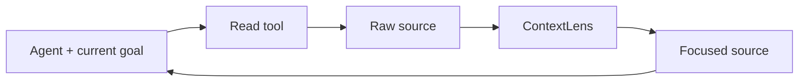
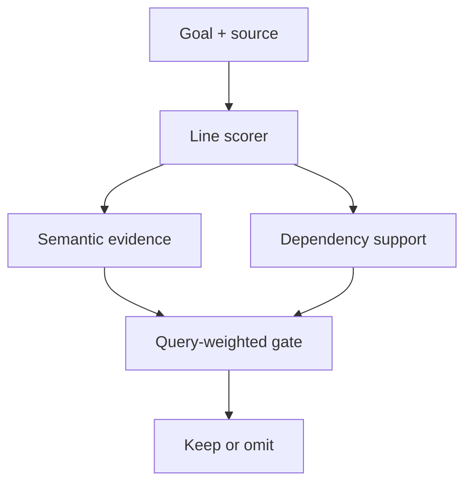
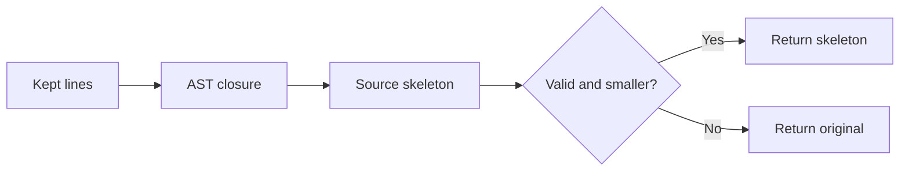
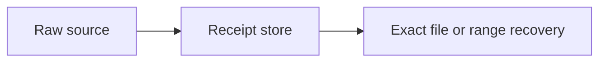

# ContextLens

ContextLens trims coding-agent observations before the next model call. It
keeps task-relevant Python plus the definitions and control flow needed to use
it. Every original is stored for exact recovery.

## See it

```python
# input: client.py
from transport import BaseTransport
from metrics import record_request

class Client(BaseTransport):
    def refresh_token(self, retry):
        record_request("refresh")
        if retry.enabled:
            return self.post("/token", timeout=retry.timeout)
        return self.post("/token")

def unrelated_report():
    ...
```

```bash
contextlens prune \
  --task "Fix the refresh-token timeout" \
  --input client.py
```

```python
from transport import BaseTransport
# [ContextLens cl_0123456789abcdef01234567 omitted original lines 3-4]

class Client(BaseTransport):
    def refresh_token(self, retry):
        # [ContextLens cl_0123456789abcdef01234567 omitted original lines 7-7]
        if retry.enabled:
            return self.post("/token", timeout=retry.timeout)
        return self.post("/token")
# [ContextLens cl_0123456789abcdef01234567 omitted original lines 11-13]
```

Semantic scores find direct evidence. Dependency scores and Python AST repair
restore imports, definitions, scopes, and branches. Those signals stay
separate and inspectable.

## Architecture

### 1. Prune inside the agent loop

Following [SWE-Pruner](https://arxiv.org/abs/2601.16746), ContextLens sits
between read tools and the agent.



### 2. Decide what to keep

[LaMR](https://arxiv.org/abs/2605.15315) separates direct evidence from code
needed to support that evidence.



Semantic lines tend to form relevant spans. Dependency lines can be sparse:
imports, scope headers, definitions, and paired control flow.

### 3. Repair and verify the result

ContextLens adds deterministic Python repair and exact recovery around the
paper-inspired scorer.





Small, unsupported, invalid, and non-saving results pass through unchanged.
Today, pruning handles Python source; other observation types are classified
but bypassed.

## Install

Requires Python 3.11+.

```bash
python -m pip install -e ".[dev]"
```

Run a line-scoring backend that implements the SWE-Pruner `/prune` contract:

```bash
export CONTEXTLENS_BACKEND_URL=http://127.0.0.1:8000/prune
```

```powershell
$env:CONTEXTLENS_BACKEND_URL = "http://127.0.0.1:8000/prune"
```

Narrow the query as the agent's focus changes:

```bash
contextlens prune \
  --task "Fix the refresh-token timeout" \
  --focus "Trace retry options passed to the request" \
  --tool read_file \
  --argument path=client.py \
  --input client.py \
  --json
```

JSON includes line-level reasons, omitted ranges, token reduction, backend,
latency, and receipt ID.

## Recover

```bash
# complete observation
contextlens recover cl_0123456789abcdef01234567

# selected original lines
contextlens recover cl_0123456789abcdef01234567 \
  --start-line 80 --end-line 130
```

Receipts live in `.contextlens/receipts` by default.

## Serve

```bash
contextlens serve --host 127.0.0.1 --port 8765
```

```text
GET  /health
POST /v1/prune
POST /v1/recover
```

The server binds to loopback by default and caps request bodies at 16 MiB.

## Develop

```bash
python -m pytest -q
ruff check src tests
mypy
```

Method references: [SWE-Pruner](https://arxiv.org/abs/2601.16746) and
[LaMR](https://arxiv.org/abs/2605.15315). ContextLens implements the general
method; it does not bundle paper checkpoints.

Released under the [MIT License](LICENSE).
