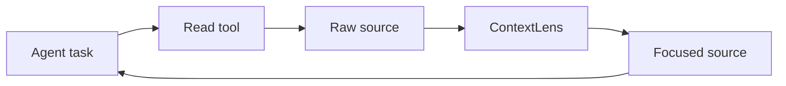
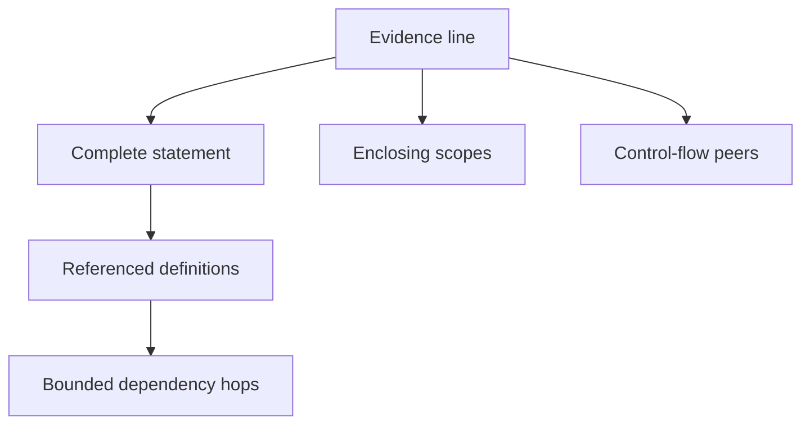
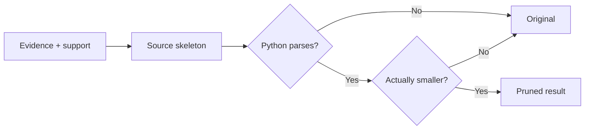

# Architecture

## Product boundary

ContextLens is a transparent context-reduction layer for coding agents. It
sits between a coding agent's tools and the coding model, reducing tool output
and source that would otherwise be injected into the expensive model.

Jev is a cheap semantic filter over already-discovered candidates. It is not
the reasoning engine and must not consume extra coding-model turns to decide
what to keep.

```text
Coding agent
    ↓
tool call
    ↓
raw tool result
    ↓
ContextLens
    ↓
smaller exact/recoverable result
    ↓
coding agent
```

It filters environment observations, not conversation history. It is not a
security filter, an agent controller, or a replacement for tests.

## Default runtime

`FilterSession` holds the task and optional focus. Each tool observation is
classified, maybe bypassed, then reduced:

1. Local structural or lexical discovery builds a shortlist.
2. One batched Jev request scores KEEP/DROP on that shortlist.
3. Deterministic AST closure adds imports, headers, and referenced locals.
4. Exact original source is returned. Omitted spans keep a receipt handle.

Small results, explicit narrow ranges, and known-symbol reads pass through.
Pinned observations are never garbage-collected automatically.

The default MCP surface is `context_filter`, `context_read`,
`context_recover`, `context_pin`, and `context_list`.

## Experimental paths

`--profile controller` (also `--profile jev`) restores the older
observe/retain/`context_next` loop. That design increased agent input and
turns in the paired pilot and is not the default.

The neural SWE-Pruner scorer and `PruningSession` remain behind
`contextlens prune` and `--profile legacy`. They are research runtimes, not
the shipping product described above.

## Experimental neural scorer

The optional SWE-Pruner runtime lazy-loads `ayanami-kitasan/code-pruner`, a
released 0.6B checkpoint based on Qwen3-Reranker-0.6B. It is not the default
Jev filter.

## Runtime loop



`PruningSession` holds the stable task across a trajectory. Its focus may
change between reads without changing task identity. Tool name, file path, and
observation type travel with each request.

## Goal creation

SWE-Pruner asks the coding agent for a complete, self-contained question that
describes its current information need. ContextLens creates that question
deterministically so every integration gets the same contract:

```text
task:  Fix the refresh timeout
focus: Trace retry options
path:  src/client.py

goal:  For the coding task 'Fix the refresh timeout', what code in
       src/client.py is needed to answer: Trace retry options?
```

Without a narrower focus, the task itself becomes the information need. The
generated goal is sent to the model and recorded in the result.

## Learned evidence selection

The default scorer lazy-loads `ayanami-kitasan/code-pruner`, the released
SWE-Pruner checkpoint based on Qwen3-Reranker-0.6B.


The official model runtime owns its prompt format, multi-layer feature fusion,
CRF pruning head, 8,192-token window, overlapping chunks, and overlap-score
averaging. ContextLens consumes its document score, model token count, and
retained line numbers.

The model loads on the first eligible observation. Small or unsupported
observations do not allocate model memory. A lock serializes local inference so
the HTTP service does not invoke one model concurrently. Local loading requires
CUDA unless the caller explicitly accepts the upstream CPU path.

An explicit `--backend http` mode calls the same SWE-Pruner `/prune`
contract out of process.

## Structural support

SWE-Pruner supplies the semantic evidence mask. Following LaMR's
semantic/dependency split, ContextLens computes a separate dependency layer
from the Python AST.



The closure restores:

- complete multi-line statements;
- decorators and class/function headers;
- enclosing branch, loop, exception, match, and context-manager headers;
- sibling `else`, `except`, `finally`, and `case` headers;
- referenced imports, assignments, functions, and classes;
- transitive definitions up to the configured hop limit.

This is the inference-time AST repair described by LaMR. ContextLens does not
claim that the released SWE-Pruner checkpoint contains LaMR's unpublished
semantic/dependency CRF heads. If a compatible backend returns independent
rubric scores, the query-conditioned weight and each reason remain visible.

## Rendering and fallback



Omitted runs become comments containing the receipt ID and original line
range. `pass` is inserted when omission would leave an empty suite. The
rendered skeleton must parse and use fewer estimated tokens or the original is
returned.

Scoring errors, invalid source, no selected lines, unsupported languages and
observation kinds, and inputs below the minimum also fail open to the original.

## Recovery and measurement

The exact observation is saved before any model call under a
content-addressed receipt. A caller can recover the whole observation or one
line range.

Each result reports:

- generated goal and model backend;
- retained lines with semantic, dependency, scope, control-flow, syntax, and
  local-context reasons;
- exact omitted ranges and receipt ID;
- original, retained, and saved token estimates;
- model/pipeline latency and bypass reason.

`PruningSession.summary()` aggregates those measurements across the complete
task trajectory.

## Current limits

The default filter path supports Python source structure plus search, test,
and log block filtering. JavaScript/TypeScript units can be shortlisted, but
AST expansion is Python-only. The neural SWE-Pruner path remains optional and
still requires Python 3.12+, PyTorch, and CUDA for practical use.

Controller, compact-find, and legacy evidence MCP profiles are kept for
reproducing earlier benchmarks. They are not the default product.
