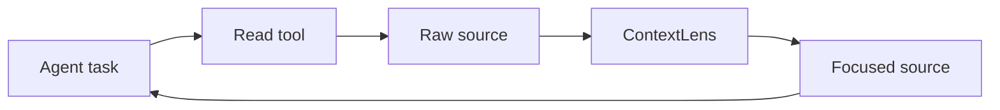
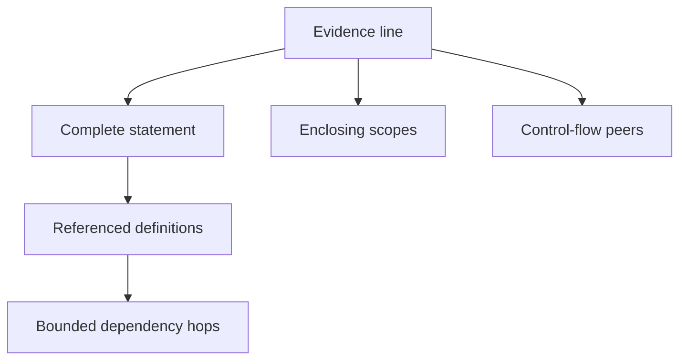
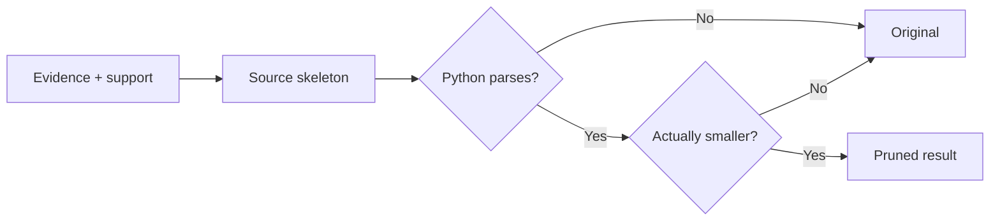

# Architecture

## Product boundary

ContextLens is task-conditioned observation pruning for coding agents. It
intercepts source returned by read tools, creates a goal question, uses the
released SWE-Pruner 0.6B model to select evidence, restores structural support,
and returns a smaller observation.

It prunes environment observations, not conversation history. It is not a
security filter or a replacement for tests.

## Runtime loop



`PruningSession` holds the stable task across a trajectory. Its focus may
change between reads without changing task identity. Tool name, file path, and
observation type travel with each request.

## Goal creation

SWE-Pruner asks the coding agent for a complete, self-contained question that
describes its current information need. ContextLens creates that question
deterministically so every integration gets the same contract:

```text
task:  Fix the refresh timeout
focus: Trace retry options
path:  src/client.py

goal:  For the coding task 'Fix the refresh timeout', what code in
       src/client.py is needed to answer: Trace retry options?
```

Without a narrower focus, the task itself becomes the information need. The
generated goal is sent to the model and recorded in the result.

## Learned evidence selection

The default scorer lazy-loads `ayanami-kitasan/code-pruner`, the released
SWE-Pruner checkpoint based on Qwen3-Reranker-0.6B.


The official model runtime owns its prompt format, multi-layer feature fusion,
CRF pruning head, 8,192-token window, overlapping chunks, and overlap-score
averaging. ContextLens consumes its document score, model token count, and
retained line numbers.

The model loads on the first eligible observation. Small or unsupported
observations do not allocate model memory. A lock serializes local inference so
the HTTP service does not invoke one model concurrently. Local loading requires
CUDA unless the caller explicitly accepts the upstream CPU path.

An explicit `--backend http` mode calls the same SWE-Pruner `/prune`
contract out of process.

## Structural support

SWE-Pruner supplies the semantic evidence mask. Following LaMR's
semantic/dependency split, ContextLens computes a separate dependency layer
from the Python AST.



The closure restores:

- complete multi-line statements;
- decorators and class/function headers;
- enclosing branch, loop, exception, match, and context-manager headers;
- sibling `else`, `except`, `finally`, and `case` headers;
- referenced imports, assignments, functions, and classes;
- transitive definitions up to the configured hop limit.

This is the inference-time AST repair described by LaMR. ContextLens does not
claim that the released SWE-Pruner checkpoint contains LaMR's unpublished
semantic/dependency CRF heads. If a compatible backend returns independent
rubric scores, the query-conditioned weight and each reason remain visible.

## Rendering and fallback



Omitted runs become comments containing the receipt ID and original line
range. `pass` is inserted when omission would leave an empty suite. The
rendered skeleton must parse and use fewer estimated tokens or the original is
returned.

Scoring errors, invalid source, no selected lines, unsupported languages and
observation kinds, and inputs below the minimum also fail open to the original.

## Recovery and measurement

The exact observation is saved before any model call under a
content-addressed receipt. A caller can recover the whole observation or one
line range.

Each result reports:

- generated goal and model backend;
- retained lines with semantic, dependency, scope, control-flow, syntax, and
  local-context reasons;
- exact omitted ranges and receipt ID;
- original, retained, and saved token estimates;
- model/pipeline latency and bypass reason.

`PruningSession.summary()` aggregates those measurements across the complete
task trajectory.

## Current limits

The structural path supports Python source. Search output, logs, JSON, other
languages, and plain text currently pass through. The released model requires
Python 3.12+, PyTorch, CUDA for practical use, and 1,345,835,359 bytes of
checkpoint storage. ContextLens installs `hf-xet` for the checkpoint's Xet
transport; accelerator performance follows the upstream SWE-Pruner runtime.

The repository still contains earlier context-evaluation modules for
compatibility and research, but the installed `contextlens` command exposes
the pruning runtime described here.
